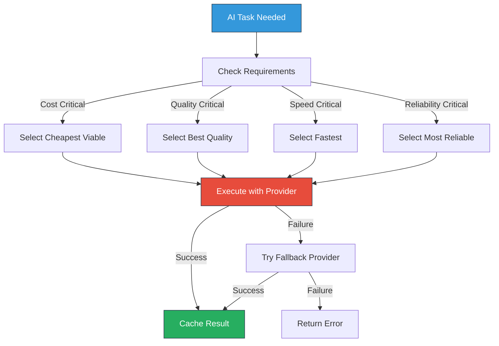
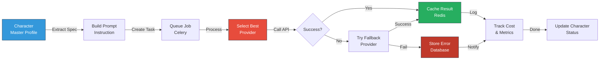

# AI Architecture - NabhaVerse Studio

**Version:** 1.0  
**Status:** Architecture Review  
**Last Updated:** 2026-07-07  
**Author:** Architecture Team  
**Project:** NabhaVerse Studio

---

## Table of Contents

1. [Purpose & Scope](#purpose--scope)
2. [AI Integration Strategy](#ai-integration-strategy)
3. [Provider Abstraction](#provider-abstraction)
4. [AI Pipeline Architecture](#ai-pipeline-architecture)
5. [Prompt Management](#prompt-management)
6. [Background Processing](#background-processing)
7. [Cost Optimization](#cost-optimization)
8. [Design Decisions](#design-decisions)
9. [Risks & Mitigations](#risks--mitigations)
10. [Future Improvements](#future-improvements)
11. [References](#references)

---

## Purpose & Scope

### Purpose
Define how NabhaVerse Studio integrates with AI services, manages prompts, and orchestrates content generation workflows.

### Scope
- Multiple AI provider support (OpenAI, ElevenLabs, Google Veo, Replicate, Fal.ai)
- Adapter/Provider pattern for flexibility
- Async prompt generation and management
- Cost tracking and optimization
- Fallback mechanisms for reliability
- Future self-hosted option support

### Key Principles
- **Abstraction:** Business logic independent of specific providers
- **Reliability:** Graceful degradation when providers fail
- **Cost-awareness:** Track and optimize AI spending
- **Flexibility:** Easy to add new providers
- **Auditability:** Complete history of all AI operations

---

## AI Integration Strategy

### Supported Providers (MVP)

| Provider | Use Case | Integration | Cost Model |
|----------|----------|-------------|------------|
| **OpenAI** | Text generation (prompts, scripts) | REST API | Pay-per-token |
| **ElevenLabs** | Voice generation | REST API | Pay-per-character |
| **Replicate** | Image generation | REST API | Pay-per-run |
| **Fal.ai** | Serverless AI APIs | REST API | Pay-per-run |
| **Google Veo** | Video generation (future) | REST API | Pay-per-token |

### Future Self-Hosted Options
- **ComfyUI:** Node-based image generation workflows
- **Ollama:** Local LLM inference
- **Stable Diffusion:** Local image generation
- **Whisper:** Local speech recognition

### Provider Selection Criteria



---

## Provider Abstraction

### Interface Definition

```python
from abc import ABC, abstractmethod
from typing import Dict, Any, Optional
from dataclasses import dataclass
from enum import Enum

class AIProviderType(str, Enum):
    """Supported AI provider types."""
    OPENAI = "openai"
    ELEVENLABS = "elevenlabs"
    REPLICATE = "replicate"
    FALAIF = "fal.ai"
    GOOGLE_VEO = "google_veo"
    OLLAMA = "ollama"
    COMFYUI = "comfyui"

@dataclass
class AIProviderConfig:
    """Configuration for an AI provider."""
    type: AIProviderType
    api_key: str
    api_url: Optional[str] = None
    model: Optional[str] = None
    timeout: int = 30
    max_retries: int = 3

@dataclass
class AIResult:
    """Result from AI operation."""
    content: str
    provider: AIProviderType
    model: str
    cost: float
    tokens_used: Optional[Dict[str, int]] = None
    execution_time: float = 0.0

class AIProvider(ABC):
    """Abstract base class for AI providers."""
    
    def __init__(self, config: AIProviderConfig):
        self.config = config
        self.type = config.type
    
    @abstractmethod
    async def generate_prompt(
        self,
        spec: Dict[str, Any],
        context: Optional[Dict[str, Any]] = None
    ) -> AIResult:
        """Generate prompt from specification.
        
        Args:
            spec: Specification object (character, location, episode, etc.)
            context: Additional context for generation
            
        Returns:
            Generated prompt and metadata
        """
        pass
    
    @abstractmethod
    async def generate_voice_prompt(
        self,
        text: str,
        voice_profile: Dict[str, Any]
    ) -> AIResult:
        """Generate voice prompt.
        
        Args:
            text: Text to convert to voice prompt
            voice_profile: Voice characteristics and settings
            
        Returns:
            Voice prompt or audio URL
        """
        pass
    
    @abstractmethod
    async def health_check(self) -> bool:
        """Check if provider is available."""
        pass
```

### Concrete Provider Implementation

```python
import openai
import asyncio
from datetime import datetime

class OpenAIProvider(AIProvider):
    """OpenAI implementation."""
    
    def __init__(self, config: AIProviderConfig):
        super().__init__(config)
        openai.api_key = config.api_key
        self.model = config.model or "gpt-4"
    
    async def generate_prompt(
        self,
        spec: Dict[str, Any],
        context: Optional[Dict[str, Any]] = None
    ) -> AIResult:
        """Generate prompt using GPT-4."""
        try:
            # Build prompt instruction
            instruction = self._build_instruction(spec, context)
            
            # Call OpenAI API
            start_time = datetime.utcnow()
            response = await asyncio.to_thread(
                openai.ChatCompletion.create,
                model=self.model,
                messages=[
                    {"role": "system", "content": "You are an expert AI prompt engineer"},
                    {"role": "user", "content": instruction}
                ],
                temperature=0.7,
                max_tokens=2000
            )
            execution_time = (datetime.utcnow() - start_time).total_seconds()
            
            # Extract result
            content = response.choices[0].message.content
            tokens_used = {
                "prompt_tokens": response.usage.prompt_tokens,
                "completion_tokens": response.usage.completion_tokens,
            }
            cost = self._calculate_cost(tokens_used)
            
            return AIResult(
                content=content,
                provider=self.type,
                model=self.model,
                cost=cost,
                tokens_used=tokens_used,
                execution_time=execution_time
            )
        except Exception as e:
            logger.error(f"OpenAI error: {e}")
            raise AIProviderError(f"OpenAI failed: {str(e)}")
    
    async def generate_voice_prompt(self, text: str, voice_profile: Dict) -> AIResult:
        # Implementation
        pass
    
    async def health_check(self) -> bool:
        try:
            response = await asyncio.to_thread(
                openai.ChatCompletion.create,
                model=self.model,
                messages=[{"role": "user", "content": "ping"}],
                max_tokens=1
            )
            return True
        except:
            return False
    
    def _build_instruction(self, spec: Dict, context: Optional[Dict]) -> str:
        """Build prompt instruction."""
        # Implementation
        pass
    
    def _calculate_cost(self, tokens: Dict[str, int]) -> float:
        """Calculate API cost based on tokens."""
        # GPT-4 pricing: $0.03 per 1K prompt tokens, $0.06 per 1K completion tokens
        prompt_cost = (tokens["prompt_tokens"] / 1000) * 0.03
        completion_cost = (tokens["completion_tokens"] / 1000) * 0.06
        return prompt_cost + completion_cost
```

### Provider Factory

```python
class AIProviderFactory:
    """Factory for creating AI providers."""
    
    _providers: Dict[AIProviderType, Type[AIProvider]] = {
        AIProviderType.OPENAI: OpenAIProvider,
        AIProviderType.ELEVENLABS: ElevenLabsProvider,
        AIProviderType.REPLICATE: ReplicateProvider,
        AIProviderType.FALAIF: FalAIProvider,
    }
    
    @classmethod
    def create(
        cls,
        config: AIProviderConfig
    ) -> AIProvider:
        """Create provider instance.
        
        Args:
            config: Provider configuration
            
        Returns:
            Initialized provider instance
            
        Raises:
            ValueError: If provider type not supported
        """
        provider_class = cls._providers.get(config.type)
        if not provider_class:
            raise ValueError(f"Unsupported provider: {config.type}")
        return provider_class(config)
    
    @classmethod
    def register(
        cls,
        provider_type: AIProviderType,
        provider_class: Type[AIProvider]
    ) -> None:
        """Register new provider."""
        cls._providers[provider_type] = provider_class
```

---

## AI Pipeline Architecture

### Character Prompt Generation Pipeline



### Implementation

```python
from app.domain.characters.models import Character
from app.infrastructure.ai.provider_factory import AIProviderFactory
from app.infrastructure.ai.prompt_builder import PromptBuilder
from app.infrastructure.cache import redis_client
from app.background.tasks.ai import store_generated_prompt

class CharacterPromptGenerator:
    """Orchestrates character prompt generation."""
    
    def __init__(
        self,
        provider_factory: AIProviderFactory,
        prompt_builder: PromptBuilder,
        cache_client,
        db: AsyncSession
    ):
        self.provider_factory = provider_factory
        self.prompt_builder = prompt_builder
        self.cache = cache_client
        self.db = db
    
    async def generate(
        self,
        character: Character,
        studio_id: str
    ) -> AIResult:
        """Generate prompt for character.
        
        Args:
            character: Character to generate prompt for
            studio_id: Studio context
            
        Returns:
            Generated prompt and metadata
        """
        # Check cache first
        cache_key = f"character_prompt:{character.id}"
        cached = await self.cache.get(cache_key)
        if cached:
            return AIResult.parse_obj(cached)
        
        try:
            # Build instruction
            spec = character.to_prompt_spec()
            instruction = self.prompt_builder.build_character_prompt(spec)
            
            # Get provider config for studio
            provider_config = await self._get_provider_config(studio_id)
            provider = self.provider_factory.create(provider_config)
            
            # Generate prompt
            result = await provider.generate_prompt(spec)
            
            # Cache result
            await self.cache.setex(
                cache_key,
                24 * 3600,  # 24 hours
                result.dict()
            )
            
            # Store in database (async)
            store_generated_prompt.delay(
                character_id=character.id,
                studio_id=studio_id,
                prompt=result.content,
                provider=result.provider.value,
                cost=result.cost
            )
            
            return result
        except Exception as e:
            logger.error(f"Prompt generation failed: {e}")
            raise
    
    async def _get_provider_config(self, studio_id: str) -> AIProviderConfig:
        """Get provider config for studio."""
        # Implementation: fetch from database based on studio settings
        pass
```

---

## Prompt Management

### Prompt Library

```python
class PromptLibraryService:
    """Manages reusable prompts."""
    
    async def create_master_prompt(
        self,
        studio_id: str,
        name: str,
        content: str,
        prompt_type: str,
        tags: List[str] = None
    ) -> MasterPrompt:
        """Create reusable master prompt."""
        prompt = MasterPrompt(
            studio_id=studio_id,
            name=name,
            content=content,
            prompt_type=prompt_type,
            tags=tags or [],
            version=1
        )
        await self.repository.create(prompt)
        return prompt
    
    async def get_master_prompt(
        self,
        prompt_id: str,
        studio_id: str
    ) -> Optional[MasterPrompt]:
        """Get master prompt by ID."""
        return await self.repository.get(prompt_id, studio_id)
    
    async def search_prompts(
        self,
        studio_id: str,
        query: str,
        prompt_type: Optional[str] = None,
        tags: List[str] = None
    ) -> List[MasterPrompt]:
        """Search master prompts."""
        return await self.repository.search(studio_id, query, prompt_type, tags)
    
    async def create_negative_prompt(
        self,
        studio_id: str,
        content: str
    ) -> NegativePrompt:
        """Create negative prompt for quality control."""
        prompt = NegativePrompt(
            studio_id=studio_id,
            content=content
        )
        await self.repository.create(prompt)
        return prompt
```

---

## Background Processing

### AI Task Queue

```python
from celery import shared_task
import logging

logger = logging.getLogger(__name__)

@shared_task(bind=True, max_retries=3)
def generate_character_prompt(self, character_id: str, studio_id: str):
    """Generate character prompt asynchronously.
    
    Args:
        character_id: Character to generate prompt for
        studio_id: Studio context
    """
    try:
        # Get dependencies from DI container
        async_db = get_async_db()
        provider_factory = get_provider_factory()
        
        # Get character
        character = async_db.query(Character).get(character_id)
        if not character:
            logger.error(f"Character not found: {character_id}")
            return
        
        # Generate prompt
        generator = CharacterPromptGenerator(...)
        result = await generator.generate(character, studio_id)
        
        # Log result
        logger.info(
            f"Generated prompt for {character_id}",
            extra={
                "character_id": character_id,
                "provider": result.provider.value,
                "cost": result.cost,
                "execution_time": result.execution_time
            }
        )
    except Exception as exc:
        logger.error(f"Prompt generation task failed: {exc}")
        # Retry with exponential backoff
        self.retry(exc=exc, countdown=60 * (2 ** self.request.retries))
```

---

## Cost Optimization

### Cost Tracking

```python
class AICostTracker:
    """Tracks and analyzes AI spending."""
    
    async def record_usage(
        self,
        studio_id: str,
        provider: AIProviderType,
        model: str,
        cost: float,
        tokens_used: Optional[Dict] = None
    ) -> AICostRecord:
        """Record AI usage and cost."""
        record = AICostRecord(
            studio_id=studio_id,
            provider=provider,
            model=model,
            cost=cost,
            tokens_used=tokens_used,
            timestamp=datetime.utcnow()
        )
        await self.repository.create(record)
        
        # Update studio spending
        await self._update_studio_monthly_spending(studio_id, cost)
        
        return record
    
    async def get_studio_spending(
        self,
        studio_id: str,
        start_date: date,
        end_date: date
    ) -> Dict[str, Any]:
        """Get studio spending for period."""
        records = await self.repository.get_by_date_range(
            studio_id, start_date, end_date
        )
        
        spending_by_provider = {}
        total_cost = 0
        
        for record in records:
            provider_name = record.provider.value
            if provider_name not in spending_by_provider:
                spending_by_provider[provider_name] = 0
            spending_by_provider[provider_name] += record.cost
            total_cost += record.cost
        
        return {
            "total_cost": total_cost,
            "by_provider": spending_by_provider,
            "by_model": self._group_by_model(records),
            "daily_breakdown": self._get_daily_breakdown(records)
        }
    
    async def get_cost_recommendations(
        self,
        studio_id: str
    ) -> List[str]:
        """Get AI cost optimization recommendations."""
        spending = await self.get_studio_spending(
            studio_id,
            date.today() - timedelta(days=30),
            date.today()
        )
        
        recommendations = []
        
        # Check for expensive models
        if spending["total_cost"] > 100:  # $100/month threshold
            recommendations.append(
                "Consider using GPT-3.5 instead of GPT-4 for some tasks"
            )
        
        # Check for provider diversity
        if len(spending["by_provider"]) == 1:
            recommendations.append(
                "Consider using multiple providers for cost optimization"
            )
        
        return recommendations
```

---

## Design Decisions

### 1. Why Adapter Pattern?
**Decision:** Use adapter/provider pattern for AI services

**Rationale:**
- ✅ Easy to switch providers without changing business logic
- ✅ Future self-hosted option support
- ✅ Cost optimization through provider selection
- ✅ Fallback mechanisms for reliability
- ⚠️ Additional abstraction layer to maintain

### 2. Why Async Background Processing?
**Decision:** Use Celery for long-running AI tasks

**Rationale:**
- ✅ Doesn't block user requests
- ✅ Retry logic for failed tasks
- ✅ Easy to scale workers
- ✅ Task monitoring and debugging
- ⚠️ Additional infrastructure (Redis)

### 3. Why Cost Tracking?
**Decision:** Comprehensive cost tracking for every AI operation

**Rationale:**
- ✅ Budget control
- ✅ Identify expensive operations
- ✅ Inform pricing decisions
- ✅ Detect unusual spending patterns
- ⚠️ Database overhead for tracking

---

## Risks & Mitigations

| Risk | Severity | Mitigation |
|------|----------|------------|
| **Provider unavailability** | High | Multiple providers, fallback logic, queue retry |
| **Cost explosion** | High | Rate limiting, spending limits, cost alerts |
| **API rate limits** | Medium | Queue management, request batching, backoff |
| **Prompt quality issues** | Medium | Prompt engineering, version control, user feedback |
| **Data privacy (AI training)** | High | Privacy-focused providers, data contracts |

---

## Future Improvements

1. **Fine-tuning:** Custom models for studio-specific content
2. **Self-hosted models:** Local inference with Ollama/ComfyUI
3. **Prompt optimization:** ML-based prompt optimization
4. **Multi-stage generation:** Complex workflows with multiple AI calls
5. **Cost prediction:** ML models to predict AI spending

---

## References

- [System Architecture](./SYSTEM_ARCHITECTURE.md)
- [Background Worker Architecture](./BACKGROUND_WORKER_ARCHITECTURE.md)
- [External Integrations](./EXTERNAL_INTEGRATIONS.md)
- [Cost Management](./COST_MANAGEMENT.md)

---

**Last Updated:** 2026-07-07  
**Version:** 1.0  
**Status:** Approved for Implementation
