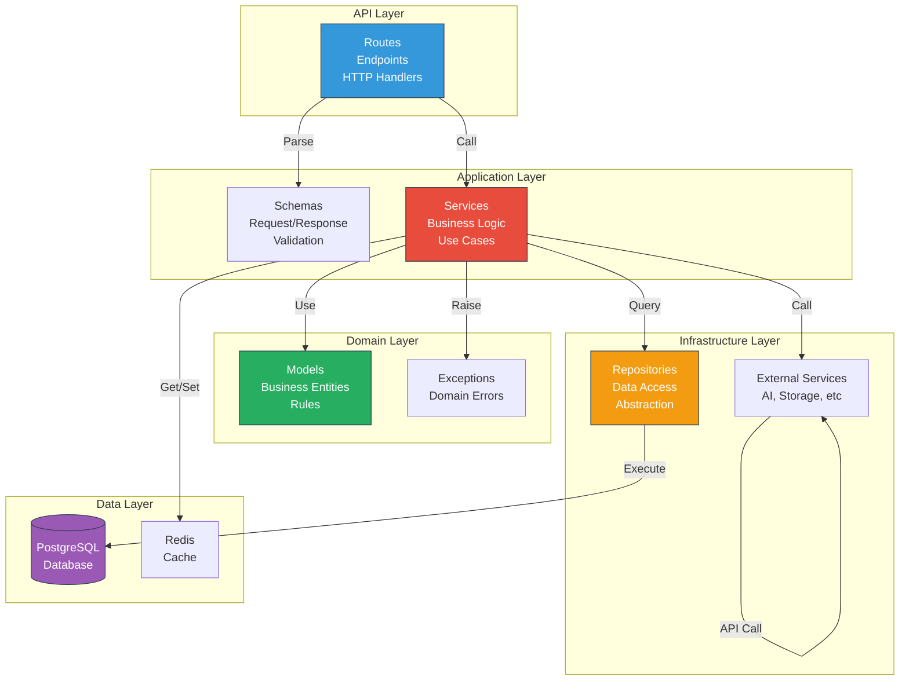

# Backend Architecture - NabhaVerse Studio

**Version:** 1.0  
**Status:** Architecture Review  
**Last Updated:** 2026-07-07  
**Author:** Architecture Team  
**Project:** NabhaVerse Studio

---

## Table of Contents

1. [Purpose & Scope](#purpose--scope)
2. [Technology Stack](#technology-stack)
3. [Architecture Pattern](#architecture-pattern)
4. [Project Structure](#project-structure)
5. [Service Design](#service-design)
6. [Request Handling](#request-handling)
7. [Data Access Layer](#data-access-layer)
8. [Error Handling](#error-handling)
9. [Design Decisions](#design-decisions)
10. [Risks & Mitigations](#risks--mitigations)
11. [Future Improvements](#future-improvements)
12. [References](#references)

---

## Purpose & Scope

### Purpose
Define the backend architecture for NabhaVerse Studio, including service design, data access patterns, and request handling logic.

### Scope
- FastAPI-based microservices (monolithic initially)
- Domain-driven design for service organization
- Async/await for all I/O operations
- PostgreSQL as primary database
- Redis for caching and job queue
- Celery for background processing

### Responsibilities
- Define clear service boundaries
- Ensure data consistency and integrity
- Handle concurrent requests efficiently
- Integrate with external AI services
- Provide reliable background processing

---

## Technology Stack

| Component | Technology | Version | Why |
|-----------|-----------|---------|-----|
| **Framework** | FastAPI | 0.104+ | Async-first, excellent performance, auto OpenAPI docs |
| **ASGI Server** | Uvicorn | 0.24+ | Lightweight, high performance |
| **ORM** | SQLAlchemy | 2.0+ | Async support, excellent for complex queries |
| **Validation** | Pydantic | 2.0+ | Type-safe, automatic validation |
| **Database** | PostgreSQL | 15+ | ACID compliance, JSON support |
| **Cache** | Redis | 7.0+ | Fast, reliable, versatile |
| **Task Queue** | Celery | 5.3+ | Reliable, scalable job processing |
| **Async SQL** | asyncpg | 0.28+ | High-performance PostgreSQL driver |
| **HTTP Client** | httpx | 0.24+ | Async-capable, similar to requests |
| **Testing** | Pytest | 7.4+ | Industry standard with great fixtures |
| **Linting** | Ruff | 0.0.292+ | Fast, comprehensive Python linter |
| **Formatting** | Black | 23.7+ | Consistent code formatting |

---

## Architecture Pattern

### Layered Architecture (Clean Architecture)



### Dependency Flow

```
API Routes
    ↓
Request Schemas (Pydantic validation)
    ↓
Services (Business Logic)
    ↓
Domain Models (Business Rules)
    ↓
Repositories (Data Access)
    ↓
Database / Cache
```

**Key Principle:** Dependencies point inward. The database doesn't know about routes.

---

## Project Structure

```
app/
├── main.py                          # Application entry point
├── config.py                        # Configuration management
├── dependencies.py                  # Dependency injection
├── middleware.py                    # Custom middleware
│
├── core/
│   ├── security.py                  # JWT, password hashing
│   ├── exceptions.py                # Application exceptions
│   ├── constants.py                 # App constants
│   └── types.py                     # Custom types
│
├── domain/                          # Business logic (Core)
│   ├── characters/
│   │   ├── models.py                # Character entity
│   │   ├── repository.py            # Character data access
│   │   ├── service.py               # Character business logic
│   │   ├── exceptions.py            # Character-specific errors
│   │   └── constants.py             # Character constants
│   ├── episodes/
│   ├── world/
│   ├── assets/
│   ├── ai/
│   ├── production/
│   └── publishing/
│
├── infrastructure/
│   ├── database/
│   │   ├── session.py               # DB session management
│   │   ├── models.py                # SQLAlchemy ORM models
│   │   └── migrations/              # Alembic migrations
│   ├── cache/
│   │   └── redis.py                 # Redis client
│   ├── storage/
│   │   └── s3.py                    # Supabase Storage client
│   └── ai/
│       ├── openai_provider.py       # OpenAI implementation
│       ├── elevenlabs_provider.py   # ElevenLabs implementation
│       └── base.py                  # Provider interface
│
├── api/
│   ├── v1/
│   │   ├── router.py                # Main router
│   │   ├── characters/
│   │   │   ├── routes.py            # Character endpoints
│   │   │   └── schemas.py           # Character request/response schemas
│   │   ├── episodes/
│   │   ├── assets/
│   │   ├── ai/
│   │   └── auth/
│   └── health/
│       └── routes.py                # Health check endpoints
│
├── background/
│   ├── celery_app.py                # Celery configuration
│   ├── tasks/
│   │   ├── characters.py            # Character tasks
│   │   ├── episodes.py              # Episode tasks
│   │   ├── ai.py                    # AI tasks
│   │   └── notifications.py         # Notification tasks
│   └── handlers/
│       └── error_handler.py         # Task error handling
│
├── utils/
│   ├── logger.py                    # Logging configuration
│   ├── validators.py                # Custom validators
│   └── helpers.py                   # Helper functions
│
└── tests/
    ├── conftest.py                  # Pytest configuration
    ├── unit/
    │   ├── domain/
    │   └── api/
    └── integration/
        └── api/
```

---

## Service Design

### Character Service Example

```python
from typing import List, Optional
from sqlalchemy.ext.asyncio import AsyncSession
from app.domain.characters.models import Character
from app.domain.characters.repository import CharacterRepository
from app.domain.characters.exceptions import CharacterNotFound

class CharacterService:
    """Business logic for character operations."""
    
    def __init__(self, db: AsyncSession, cache_client: Redis):
        self.db = db
        self.cache = cache_client
        self.repository = CharacterRepository(db)
    
    async def create_character(
        self,
        studio_id: str,
        data: CharacterCreateSchema
    ) -> Character:
        """Create a new character.
        
        Args:
            studio_id: Studio identifier
            data: Character creation data
            
        Returns:
            Created character object
            
        Raises:
            ValidationError: If data is invalid
        """
        # Create character
        character = await self.repository.create(studio_id, data)
        
        # Invalidate cache
        await self._invalidate_studio_cache(studio_id)
        
        # Queue prompt generation (async)
        from app.background.tasks.ai import generate_character_prompt
        generate_character_prompt.delay(character.id)
        
        return character
    
    async def get_character(
        self,
        character_id: str,
        studio_id: str
    ) -> Character:
        """Get character by ID.
        
        Args:
            character_id: Character identifier
            studio_id: Studio identifier (for auth)
            
        Returns:
            Character object
            
        Raises:
            CharacterNotFound: If character doesn't exist
            UnauthorizedError: If user can't access character
        """
        # Try cache first
        cache_key = f"character:{character_id}"
        cached = await self.cache.get(cache_key)
        if cached:
            return Character.parse_obj(cached)
        
        # Fetch from database
        character = await self.repository.get(character_id, studio_id)
        if not character:
            raise CharacterNotFound(character_id)
        
        # Cache result
        await self.cache.setex(
            cache_key,
            3600,  # 1 hour
            character.dict()
        )
        
        return character
    
    async def _invalidate_studio_cache(self, studio_id: str) -> None:
        """Invalidate all studio character caches."""
        cache_key = f"studio:{studio_id}:characters"
        await self.cache.delete(cache_key)
```

---

## Request Handling

### FastAPI Endpoint Pattern

```python
from fastapi import APIRouter, Depends, HTTPException, status
from sqlalchemy.ext.asyncio import AsyncSession
from app.api.v1.characters.schemas import (
    CharacterCreateSchema,
    CharacterResponseSchema,
)
from app.domain.characters.service import CharacterService
from app.core.security import get_current_user
from app.infrastructure.database import get_db_session

router = APIRouter(prefix="/characters", tags=["characters"])

@router.post(
    "",
    response_model=CharacterResponseSchema,
    status_code=status.HTTP_201_CREATED,
)
async def create_character(
    data: CharacterCreateSchema,
    current_user: dict = Depends(get_current_user),
    db: AsyncSession = Depends(get_db_session),
) -> CharacterResponseSchema:
    """Create a new character.
    
    Args:
        data: Character creation data
        current_user: Authenticated user
        db: Database session
        
    Returns:
        Created character
        
    Raises:
        HTTPException: If creation fails
    """
    try:
        service = CharacterService(db)
        character = await service.create_character(
            studio_id=current_user["studio_id"],
            data=data
        )
        return CharacterResponseSchema.from_orm(character)
    except ValidationError as e:
        raise HTTPException(
            status_code=status.HTTP_400_BAD_REQUEST,
            detail=str(e)
        )
    except Exception as e:
        logger.error(f"Failed to create character: {e}")
        raise HTTPException(
            status_code=status.HTTP_500_INTERNAL_SERVER_ERROR,
            detail="Failed to create character"
        )

@router.get(
    "/{character_id}",
    response_model=CharacterResponseSchema,
)
async def get_character(
    character_id: str,
    current_user: dict = Depends(get_current_user),
    db: AsyncSession = Depends(get_db_session),
) -> CharacterResponseSchema:
    """Get character by ID."""
    service = CharacterService(db)
    try:
        character = await service.get_character(
            character_id=character_id,
            studio_id=current_user["studio_id"]
        )
        return CharacterResponseSchema.from_orm(character)
    except CharacterNotFound:
        raise HTTPException(
            status_code=status.HTTP_404_NOT_FOUND,
            detail="Character not found"
        )
```

---

## Data Access Layer

### Repository Pattern

```python
from typing import List, Optional
from sqlalchemy import select
from sqlalchemy.ext.asyncio import AsyncSession
from app.infrastructure.database.models import CharacterModel
from app.domain.characters.models import Character

class CharacterRepository:
    """Data access for characters."""
    
    def __init__(self, db: AsyncSession):
        self.db = db
    
    async def create(self, studio_id: str, data: dict) -> Character:
        """Create a new character."""
        db_model = CharacterModel(
            studio_id=studio_id,
            **data
        )
        self.db.add(db_model)
        await self.db.commit()
        await self.db.refresh(db_model)
        return Character.from_orm(db_model)
    
    async def get(self, character_id: str, studio_id: str) -> Optional[Character]:
        """Get character by ID."""
        stmt = select(CharacterModel).where(
            CharacterModel.id == character_id,
            CharacterModel.studio_id == studio_id
        )
        result = await self.db.execute(stmt)
        db_model = result.scalars().first()
        return Character.from_orm(db_model) if db_model else None
    
    async def list_by_studio(self, studio_id: str, skip: int = 0, limit: int = 100) -> List[Character]:
        """List characters by studio."""
        stmt = select(CharacterModel).where(
            CharacterModel.studio_id == studio_id
        ).offset(skip).limit(limit)
        result = await self.db.execute(stmt)
        db_models = result.scalars().all()
        return [Character.from_orm(model) for model in db_models]
    
    async def update(self, character_id: str, data: dict) -> Character:
        """Update character."""
        db_model = await self.db.get(CharacterModel, character_id)
        if not db_model:
            return None
        for key, value in data.items():
            setattr(db_model, key, value)
        await self.db.commit()
        await self.db.refresh(db_model)
        return Character.from_orm(db_model)
    
    async def delete(self, character_id: str) -> bool:
        """Delete character."""
        db_model = await self.db.get(CharacterModel, character_id)
        if not db_model:
            return False
        await self.db.delete(db_model)
        await self.db.commit()
        return True
```

---

## Error Handling

### Exception Hierarchy

```python
class NabhaVerseException(Exception):
    """Base exception for all domain exceptions."""
    pass

class ValidationError(NabhaVerseException):
    """Validation failed."""
    pass

class NotFoundError(NabhaVerseException):
    """Resource not found."""
    pass

class UnauthorizedError(NabhaVerseException):
    """Unauthorized access."""
    pass

class CharacterNotFound(NotFoundError):
    """Character not found."""
    pass

class AIServiceError(NabhaVerseException):
    """AI service error."""
    pass
```

### Global Exception Handler

```python
from fastapi import FastAPI
from fastapi.responses import JSONResponse

app = FastAPI()

@app.exception_handler(NabhaVerseException)
async def nabhaverse_exception_handler(request, exc):
    return JSONResponse(
        status_code=exc.status_code,
        content={"detail": str(exc)},
    )

@app.exception_handler(Exception)
async def general_exception_handler(request, exc):
    logger.error(f"Unhandled exception: {exc}")
    return JSONResponse(
        status_code=500,
        content={"detail": "Internal server error"},
    )
```

---

## Design Decisions

### 1. Why Async/Await?
**Decision:** All I/O operations use async/await

**Rationale:**
- ✅ Better resource utilization (threads → coroutines)
- ✅ Can handle 1000s of concurrent connections
- ✅ No thread pool overhead
- ✅ Native Python support (async/await syntax)
- ⚠️ Requires async database drivers and libraries

### 2. Why Repository Pattern?
**Decision:** Abstract database access with repositories

**Rationale:**
- ✅ Decouples business logic from database
- ✅ Easy to mock for testing
- ✅ Flexible query optimization
- ✅ Single responsibility principle
- ⚠️ Additional abstraction layer

### 3. Why Pydantic for Validation?
**Decision:** Use Pydantic for request/response validation

**Rationale:**
- ✅ Type-safe validation
- ✅ Auto-generated API documentation
- ✅ Performance-optimized
- ✅ Integration with FastAPI
- ✅ Recursive model validation

### 4. Why Celery for Background Jobs?
**Decision:** Use Celery + Redis for async task processing

**Rationale:**
- ✅ Reliable job queue
- ✅ Built-in retry logic
- ✅ Task monitoring and control
- ✅ Distributed task processing
- ✅ Seamless Redis integration

---

## Risks & Mitigations

| Risk | Severity | Mitigation |
|------|----------|------------|
| **Async complexity** | Medium | Clear documentation, strong code review |
| **N+1 queries** | High | Query optimization, database monitoring |
| **Connection pool exhaustion** | Medium | Connection pooling, pgBouncer |
| **Celery task failures** | Medium | Retry logic, dead-letter queue, monitoring |
| **Pydantic version issues** | Low | Pin versions, test upgrades |

---

## Future Improvements

1. **GraphQL API:** Complement REST with GraphQL for flexible queries
2. **Service Mesh:** Istio for inter-service communication
3. **Event Sourcing:** Event-driven architecture for audit trail
4. **CQRS:** Separate read and write models for optimization
5. **Message Broker:** Kafka for high-volume event streaming

---

## References

- [System Architecture](./SYSTEM_ARCHITECTURE.md)
- [Deployment Architecture](./DEPLOYMENT_ARCHITECTURE.md)
- [Security Architecture](./SECURITY_ARCHITECTURE.md)
- [API Guidelines](../api/API_GUIDELINES.md)
- [Coding Standards](../CODING_STANDARDS.md)

---

**Last Updated:** 2026-07-07  
**Version:** 1.0  
**Status:** Approved for Implementation
