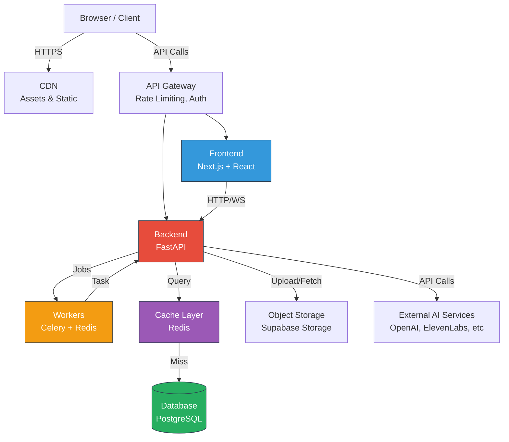
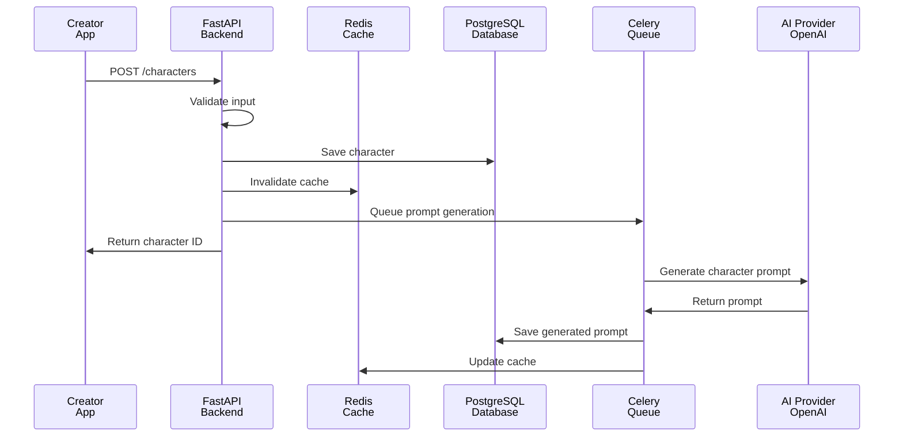
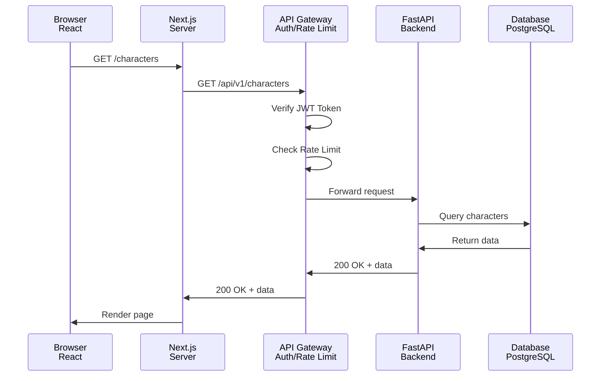

# NabhaVerse Studio - Executive Summary

**Version:** 1.0  
**Status:** Architecture Review  
**Last Updated:** 2026-07-07  
**Author:** Architecture Team  

---

## Overview

NabhaVerse Studio is a production-grade AI-powered Operating System for Animated Storytelling. It combines the collaborative features of Notion and Linear, the creative tools of Figma, and the AI capabilities of Midjourney and ElevenLabs into a unified platform for creating complete animated universes.

This document provides a high-level executive summary of the architecture, key decisions, and strategic approach to building a scalable, maintainable system that can support millions of creators building animated content.

---

## Strategic Vision

### What is NabhaVerse Studio?

A full-stack, multi-tenant AI animation platform that:
- **Enables creators** to build complete animated universes through an intuitive interface
- **Automates production** through AI-powered content generation and workflow automation
- **Integrates seamlessly** with leading AI services (OpenAI, ElevenLabs, Google Veo, etc.)
- **Scales globally** to support thousands of concurrent creators
- **Maintains enterprise quality** with strict security, performance, and reliability standards

### Success Definition

NabhaVerse Studio is successful when:
1. **MVP Launch (Week 20):** Core features operational with 100+ active users
2. **Growth Phase:** 1,000+ active studios creating content
3. **Scale Phase:** 10,000+ concurrent creators worldwide
4. **SaaS Platform:** Self-serve model with multiple subscription tiers

---

## Core Architecture Principles

### 1. Domain-Driven Design
- **Organize by business domains** (Characters, Episodes, World, Assets, etc.)
- **Not by technical layers** (Controllers, Services, Repositories)
- **Each domain is independently deployable**
- **Clear boundaries and dependencies between domains**

### 2. Scalability First
- **Stateless services** for horizontal scaling
- **Asynchronous processing** for long-running operations
- **Caching at every layer** (Redis, CDN, browser)
- **Database optimization** for millions of records

### 3. AI Integration Pattern
- **Adapter/Provider pattern** for AI services
- **Easy migration** between providers without code changes
- **Cost optimization** through provider selection
- **Fallback mechanisms** for provider failures

### 4. Developer Experience
- **Type-safe** across frontend and backend
- **Self-documenting code** with clear intent
- **Minimal magic** - explicit over implicit
- **Testability** at every layer

---

## Technology Stack Decision

| Layer | Technology | Why |
|-------|-----------|-----|
| **Frontend** | Next.js 16 + React 19 | Modern, performant, SSR support, great DX |
| **Backend** | FastAPI | Native Python, async/await, excellent for AI workloads |
| **Database** | PostgreSQL 15+ | ACID compliance, JSON support, proven at scale |
| **Cache** | Redis | Sub-millisecond performance, versatile use cases |
| **Auth** | Clerk | Zero trust, multi-tenant, excellent DX |
| **Storage** | Supabase Storage | S3-compatible, integrated with auth |
| **Workers** | Celery + Redis | Battle-tested, reliable, excellent for AI jobs |
| **Deployment** | Vercel + Railway | Zero-config, built for Next.js and FastAPI |

**Decision Rationale:**
- ✅ All technologies are battle-tested in production
- ✅ Excellent tooling and community support
- ✅ Native support for async patterns (FastAPI, Next.js)
- ✅ Easy to scale horizontally
- ✅ Cost-effective at all scales

---

## Architecture Layers



---

## Key Architectural Decisions

### 1. Monorepo with Turborepo
**Decision:** Use monorepo structure (apps + packages)
**Rationale:**
- ✅ Shared types between frontend and backend
- ✅ Unified build and test pipeline
- ✅ Easy to manage versions
- ✅ Better code reuse
- ⚠️ Requires discipline in dependency management

### 2. FastAPI Over Node.js Backend
**Decision:** Use FastAPI for backend
**Rationale:**
- ✅ Native Python ecosystem for AI/ML
- ✅ Excellent async/await support
- ✅ Built-in validation with Pydantic
- ✅ Auto-generated OpenAPI documentation
- ✅ Better for media processing (FFmpeg, Whisper)
- ⚠️ Less full-stack developer overlap

### 3. PostgreSQL as Primary Database
**Decision:** PostgreSQL for all persistent data
**Rationale:**
- ✅ ACID compliance for data integrity
- ✅ JSON support for flexible schemas
- ✅ Excellent for complex queries
- ✅ Proven at massive scale (Instagram, Spotify)
- ✅ Cost-effective
- ⚠️ Not ideal for unstructured data (use S3 instead)

### 4. Redis for Caching and Job Queue
**Decision:** Redis for cache + Celery for workers
**Rationale:**
- ✅ Sub-millisecond cache performance
- ✅ Reliable job queue for async tasks
- ✅ Built-in TTL for cache expiration
- ✅ Pub/sub for real-time features
- ⚠️ Requires additional infrastructure

### 5. Adapter Pattern for AI Services
**Decision:** Abstract AI providers behind interfaces
**Rationale:**
- ✅ Easy to switch providers without code changes
- ✅ Enables self-hosted models in future
- ✅ Cost optimization through provider selection
- ✅ Fallback mechanisms for reliability
- ⚠️ Additional abstraction layer to maintain

### 6. Domain-Driven Design Organizational Structure
**Decision:** Organize code by business domains
**Rationale:**
- ✅ Aligns with team organization
- ✅ Clear ownership and boundaries
- ✅ Independent deployment of domains
- ✅ Easier onboarding for new developers
- ⚠️ Requires good communication between teams

---

## Data Flow Architecture

### Character Creation Flow



### Request Flow (API)



---

## Security Architecture

### Authentication & Authorization
- **Clerk SSO:** OAuth, Email, GitHub, Google
- **JWT Tokens:** Secure API authentication
- **Role-Based Access:** Admin, Editor, Viewer per studio
- **API Keys:** For external integrations

### Data Protection
- **HTTPS/TLS:** All data in transit encrypted
- **Database Encryption:** Data at rest
- **Input Validation:** Zod + Pydantic on all endpoints
- **Output Sanitization:** XSS prevention

### Compliance
- **GDPR Ready:** User data exportable, deletable
- **SOC 2 Compliance:** Audit logs, monitoring
- **PCI Compliance:** Via Stripe for payments

---

## Performance Targets

| Metric | Target | Monitoring |
|--------|--------|------------|
| **Page Load** | < 1s | Vercel Analytics |
| **API Response** | < 200ms p95 | CloudWatch |
| **Database Query** | < 50ms p95 | Slow query logs |
| **Prompt Generation** | < 10s p95 | Job monitoring |
| **Uptime** | 99.9% | Health checks |
| **Cache Hit Rate** | > 80% | Redis monitoring |

---

## Scalability Approach

### Horizontal Scaling
- ✅ Stateless FastAPI services (scale with load balancer)
- ✅ Next.js on Vercel (auto-scales globally)
- ✅ Celery workers scale independently
- ✅ PostgreSQL read replicas for read scaling

### Vertical Scaling
- ✅ Database connection pooling (pgBouncer)
- ✅ Redis clustering for high throughput
- ✅ Multi-region deployment

### Cost Optimization
- ✅ CDN for static assets
- ✅ Image optimization (WebP, lazy loading)
- ✅ Database query optimization
- ✅ Smart caching strategies

---

## AI Integration Strategy

### Provider Abstraction

```python
# The adapter pattern allows swapping providers
class AIProvider(ABC):
    @abstractmethod
    async def generate_prompt(self, spec: Dict) -> str:
        pass

class OpenAIProvider(AIProvider):
    async def generate_prompt(self, spec: Dict) -> str:
        # OpenAI implementation
        pass

class OllamaProvider(AIProvider):
    async def generate_prompt(self, spec: Dict) -> str:
        # Local Ollama implementation
        pass
```

### Provider Strategy
1. **Phase 1 (MVP):** OpenAI, ElevenLabs
2. **Phase 2:** Add Google Veo, Replicate
3. **Phase 3:** Self-hosted options (ComfyUI, Ollama)
4. **Phase 4:** Hybrid approach with cost optimization

---

## Monitoring & Observability

### Logging
- **Application Logs:** Structured logging to CloudWatch
- **Access Logs:** API request/response logging
- **Error Tracking:** Sentry for exception monitoring

### Metrics
- **Application Metrics:** Request rate, latency, errors
- **Infrastructure Metrics:** CPU, memory, disk
- **Business Metrics:** Active users, characters created, episodes published

### Tracing
- **Distributed Tracing:** Jaeger for request tracing
- **Database Tracing:** Query performance monitoring
- **Job Tracing:** Celery job execution tracking

---

## Development Phases

### Milestone 1 (Week 1-4): Foundation
- ✅ Project setup and infrastructure
- ✅ Authentication and authorization
- ✅ Dashboard and character management
- ✅ Design system

### Milestone 2 (Week 5-8): Content Management
- ✅ Episodes and world modules
- ✅ Asset library
- ✅ Advanced character features

### Milestone 3 (Week 9-12): AI Integration
- ✅ AI Studio and prompt generators
- ✅ AI provider integration
- ✅ Background worker system

### Milestone 4 (Week 13-16): Automation
- ✅ Production pipeline
- ✅ Workflow automation
- ✅ Batch operations

### Milestone 5 (Week 17-20): Scale & Monetization
- ✅ Publishing module
- ✅ Analytics
- ✅ Business tools and billing

---

## Open Questions for Review

1. **Multi-region deployment:** Should we plan for multi-region from day 1?
2. **Real-time collaboration:** Should Milestone 2 include real-time editing?
3. **Mobile app:** Should we build native mobile apps or web-only for MVP?
4. **Self-hosted option:** Timeline for self-hosted/on-premise deployment?
5. **API marketplace:** Should creators be able to create extensions/plugins?

---

## Known Risks

1. **AI Provider Dependency:** Over-reliance on external AI services
   - *Mitigation:* Adapter pattern, multiple providers, self-hosted fallback

2. **Data Volumes:** Scaling database for millions of assets
   - *Mitigation:* Partitioning strategy, read replicas, caching

3. **Cost Explosion:** AI provider costs at scale
   - *Mitigation:* Provider selection, rate limiting, cost tracking

4. **Concurrent Users:** Database connection limits
   - *Mitigation:* Connection pooling, read replicas, caching

5. **Security Breach:** Unauthorized access to creator content
   - *Mitigation:* End-to-end encryption, audit logs, SOC 2 compliance

---

## Recommended Next Steps

1. **Architecture Review:** Get team approval on this document
2. **Design Database Schema:** Detailed PostgreSQL schema design
3. **Create API Specification:** OpenAPI schema for all endpoints
4. **Setup Development Environment:** Monorepo, CI/CD, local dev setup
5. **Begin Milestone 1 Implementation:** Start coding phase

---

## Architecture Review Scorecard

| Criterion | Score | Notes |
|-----------|-------|-------|
| **Scalability** | 9/10 | Stateless services, good caching strategy |
| **Security** | 8/10 | Solid auth/authz, needs penetration testing |
| **Performance** | 8/10 | Good caching, need CDN for global |
| **Maintainability** | 9/10 | DDD structure, clear separation of concerns |
| **Developer Experience** | 9/10 | Type-safe, good tooling, clear patterns |
| **Cost** | 8/10 | Reasonable infrastructure costs, AI costs TBD |
| **Time to Market** | 9/10 | Proven stack, good velocity expected |
| **Future Flexibility** | 9/10 | Adapter pattern, modular design |

**Overall Score:** 8.6/10 - Ready for implementation

---

## References

- [System Architecture Document](./architecture/SYSTEM_ARCHITECTURE.md)
- [Frontend Architecture Document](./architecture/FRONTEND_ARCHITECTURE.md)
- [Backend Architecture Document](./architecture/BACKEND_ARCHITECTURE.md)
- [AI Architecture Document](./architecture/AI_ARCHITECTURE.md)
- [Security Architecture Document](./architecture/SECURITY_ARCHITECTURE.md)
- [Deployment Architecture Document](./architecture/DEPLOYMENT_ARCHITECTURE.md)
- [Architecture Decision Records](./architecture/DECISION_LOG.md)
- [Technology Stack Decisions](./ROADMAP.md)

---

**Last Updated:** 2026-07-07  
**Version:** 1.0  
**Status:** Approved for Implementation
