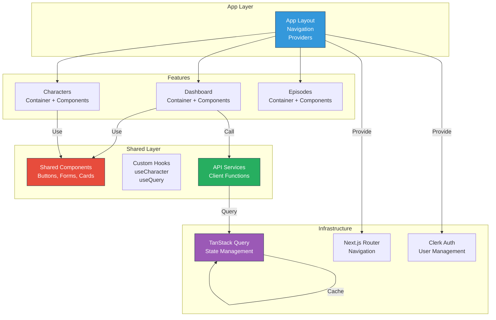

# Frontend Architecture - NabhaVerse Studio

**Version:** 1.0  
**Status:** Architecture Review  
**Last Updated:** 2026-07-07  
**Author:** Architecture Team  
**Project:** NabhaVerse Studio

---

## Table of Contents

1. [Purpose & Scope](#purpose--scope)
2. [Technology Stack](#technology-stack)
3. [Architecture Pattern](#architecture-pattern)
4. [Project Structure](#project-structure)
5. [Component Architecture](#component-architecture)
6. [State Management](#state-management)
7. [Data Fetching](#data-fetching)
8. [Routing & Navigation](#routing--navigation)
9. [Performance Optimization](#performance-optimization)
10. [Design Decisions](#design-decisions)
11. [Risks & Mitigations](#risks--mitigations)
12. [Future Improvements](#future-improvements)
13. [References](#references)

---

## Purpose & Scope

### Purpose
Define the frontend architecture for NabhaVerse Studio, including component design patterns, state management, and performance strategies.

### Scope
- Next.js 16 with App Router
- React 19 with hooks
- TypeScript with strict mode
- TanStack Query for server state
- React Hook Form for forms
- Tailwind CSS for styling
- Framer Motion for animations

### Key Principles
- **Component-driven:** Composable, reusable components
- **Type-safe:** Strict TypeScript throughout
- **Performance-first:** Optimized for speed and UX
- **Accessibility-first:** WCAG 2.1 AA compliance
- **Domain-based:** Organized by feature/domain

---

## Technology Stack

| Layer | Technology | Version | Why |
|-------|-----------|---------|-----|
| **Framework** | Next.js | 16 | SSR, static generation, excellent DX |
| **Library** | React | 19 | Component-driven UI, hooks support |
| **Language** | TypeScript | 5.2+ | Type safety, better developer experience |
| **Styling** | Tailwind CSS | 3.3+ | Utility-first, performant, consistent |
| **Components** | shadcn/ui | - | Accessible, unstyled, highly customizable |
| **State (Server)** | TanStack Query | 5.0+ | Powerful server state management |
| **State (Form)** | React Hook Form | 7.4+ | Lightweight, performant form handling |
| **Validation** | Zod | 3.22+ | Type-safe schema validation |
| **Animation** | Framer Motion | 10.16+ | Declarative animation library |
| **HTTP Client** | Fetch API + SWR | - | Modern, minimal, built-in retry |
| **Testing** | Vitest + Playwright | - | Fast unit tests + E2E tests |
| **Linting** | ESLint | 8.51+ | Code quality and consistency |
| **Formatting** | Prettier | 3.0+ | Consistent code formatting |

---

## Architecture Pattern

### Feature-Based Structure



### Data Flow

```
User Interaction
    ↓
Component Event Handler
    ↓
TanStack Query (mutation/invalidation)
    ↓
API Service (HTTP call)
    ↓
Backend API
    ↓
Database
    ↓
Response → TanStack Query Cache
    ↓
Component Rerender
    ↓
UI Update
```

---

## Project Structure

```
app/
├── layout.tsx                       # Root layout
├── page.tsx                         # Home page
├── not-found.tsx                    # 404 page
├── error.tsx                        # Error boundary
│
├── (auth)/
│   ├── layout.tsx                   # Auth layout
│   ├── login/page.tsx               # Login page
│   └── signup/page.tsx              # Signup page
│
├── (dashboard)/
│   ├── layout.tsx                   # Dashboard layout (sidebar, header)
│   ├── page.tsx                     # Dashboard overview
│   │
│   └── characters/
│       ├── page.tsx                 # Characters list
│       ├── [id]/page.tsx            # Character detail
│       ├── new/page.tsx             # Create character
│       └── [id]/edit/page.tsx       # Edit character
│   │
│   ├── episodes/
│   ├── world/
│   ├── assets/
│   ├── ai-studio/
│   ├── production/
│   └── settings/
│
├── api/                             # API routes (serverless functions)
│   └── auth/                        # Clerk webhook handlers
│
└── features/                        # Feature modules
    ├── characters/
    │   ├── components/
    │   │   ├── CharacterCard.tsx    # Presentational component
    │   │   ├── CharacterForm.tsx    # Form component
    │   │   ├── CharacterList.tsx    # List component
    │   │   └── MasterProfilePanel.tsx # Master profile UI
    │   ├── hooks/
    │   │   ├── useCharacter.ts      # Fetch single character
    │   │   ├── useCharacters.ts     # Fetch list of characters
    │   │   ├── useCharacterMutation.ts # Create/update character
    │   │   └── useCharacterForm.ts  # Form logic hook
    │   ├── services/
    │   │   └── client.ts            # API client functions
    │   ├── types/
    │   │   └── index.ts             # TypeScript types
    │   ├── schemas/
    │   │   └── character.ts         # Zod validation schemas
    │   └── index.ts                 # Barrel export
    │
    ├── episodes/
    ├── world/
    ├── dashboard/
    └── ai-studio/

src/
├── components/                      # Shared components
│   ├── ui/                          # shadcn/ui components
│   │   ├── Button.tsx
│   │   ├── Card.tsx
│   │   ├── Form.tsx
│   │   ├── Input.tsx
│   │   ├── Textarea.tsx
│   │   ├── Dialog.tsx
│   │   └── ...
│   ├── layout/
│   │   ├── Header.tsx
│   │   ├── Sidebar.tsx
│   │   └── DashboardLayout.tsx
│   ├── common/
│   │   ├── LoadingSpinner.tsx
│   │   ├── ErrorBoundary.tsx
│   │   ├── EmptyState.tsx
│   │   └── ConfirmDialog.tsx
│   └── providers/
│       ├── Providers.tsx            # Root providers
│       ├── QueryProvider.tsx        # TanStack Query setup
│       ├── AuthProvider.tsx         # Clerk setup
│       └── ThemeProvider.tsx        # Theme setup
│
├── hooks/                           # Shared hooks
│   ├── useAuth.ts
│   ├── useDebounce.ts
│   ├── usePagination.ts
│   ├── useLocalStorage.ts
│   └── useAsync.ts
│
├── services/                        # API client
│   ├── api.ts                       # HTTP client setup
│   ├── auth.ts                      # Auth API
│   └── config.ts                    # API configuration
│
├── utils/
│   ├── cn.ts                        # Classname utility
│   ├── date.ts                      # Date utilities
│   ├── format.ts                    # Formatting utilities
│   └── validation.ts                # Validation helpers
│
├── types/
│   ├── index.ts                     # Global types
│   ├── api.ts                       # API response types
│   └── domain.ts                    # Domain types
│
├── styles/
│   ├── globals.css                  # Global styles
│   ├── variables.css                # CSS variables (theme)
│   └── animations.css               # Animation keyframes
│
and tests/
├── unit/
│   ├── hooks/
│   └── utils/
└── e2e/
    └── features/
```

---

## Component Architecture

### Component Types

#### 1. Page Components (Containers)
Handles routing, data fetching, layout:

```typescript
import { CharacterListContainer } from '@/features/characters/components';
import { useAuth } from '@/hooks/useAuth';

export default async function CharactersPage() {
  return (
    <div className="space-y-6">
      <div>
        <h1 className="text-3xl font-bold">Characters</h1>
        <p className="text-gray-600">Manage your characters</p>
      </div>
      <CharacterListContainer />
    </div>
  );
}
```

#### 2. Container Components
Manage data fetching and business logic:

```typescript
import { useCharacters } from '@/features/characters/hooks';
import { CharacterList } from './CharacterList';

export function CharacterListContainer() {
  const { data, isLoading, error } = useCharacters();
  
  if (isLoading) return <LoadingSpinner />;
  if (error) return <ErrorState error={error} />;
  if (!data?.length) return <EmptyState />;
  
  return <CharacterList characters={data} />;
}
```

#### 3. Presentational Components
Render UI without business logic:

```typescript
interface CharacterCardProps {
  character: Character;
  onSelect?: (id: string) => void;
  variant?: 'compact' | 'full';
}

export function CharacterCard({
  character,
  onSelect,
  variant = 'full',
}: CharacterCardProps) {
  return (
    <Card 
      className={`cursor-pointer hover:shadow-lg transition-shadow`}
      onClick={() => onSelect?.(character.id)}
    >
      {/* Card content */}
    </Card>
  );
}
```

---

## State Management

### Server State (TanStack Query)

```typescript
import { useQuery, useMutation } from '@tanstack/react-query';
import { getCharacter, updateCharacter } from '@/features/characters/services';

function useCharacter(characterId: string) {
  return useQuery({
    queryKey: ['characters', characterId],
    queryFn: () => getCharacter(characterId),
    staleTime: 5 * 60 * 1000, // 5 minutes
    retry: 2,
  });
}

function useUpdateCharacter() {
  const queryClient = useQueryClient();
  
  return useMutation({
    mutationFn: (data) => updateCharacter(data),
    onSuccess: (data) => {
      // Invalidate and refetch
      queryClient.invalidateQueries({
        queryKey: ['characters', data.id],
      });
    },
  });
}
```

### Client State (React State)

```typescript
import { useState } from 'react';

function CharacterForm() {
  const [formData, setFormData] = useState<CharacterCreateInput>({
    name: '',
    identity: '',
  });
  
  const handleChange = (e: ChangeEvent<HTMLInputElement>) => {
    const { name, value } = e.target;
    setFormData((prev) => ({ ...prev, [name]: value }));
  };
  
  return (
    <form>
      <input
        name="name"
        value={formData.name}
        onChange={handleChange}
      />
    </form>
  );
}
```

### Form State (React Hook Form)

```typescript
import { useForm } from 'react-hook-form';
import { zodResolver } from '@hookform/resolvers/zod';
import { characterSchema } from '@/features/characters/schemas';

function CharacterForm() {
  const form = useForm<CharacterCreateInput>({
    resolver: zodResolver(characterSchema),
  });
  
  return (
    <form onSubmit={form.handleSubmit(onSubmit)}>
      <Controller
        control={form.control}
        name="name"
        render={({ field }) => (
          <Input
            {...field}
            error={form.formState.errors.name?.message}
          />
        )}
      />
    </form>
  );
}
```

---

## Data Fetching

### API Service Pattern

```typescript
import { API_BASE_URL } from '@/services/config';

type HttpMethod = 'GET' | 'POST' | 'PUT' | 'DELETE' | 'PATCH';

class ApiClient {
  async request<T>(
    endpoint: string,
    method: HttpMethod = 'GET',
    body?: unknown
  ): Promise<T> {
    const response = await fetch(`${API_BASE_URL}${endpoint}`, {
      method,
      headers: {
        'Content-Type': 'application/json',
      },
      body: body ? JSON.stringify(body) : undefined,
    });
    
    if (!response.ok) {
      throw new Error(`API error: ${response.statusText}`);
    }
    
    return response.json();
  }
}

export const apiClient = new ApiClient();

// Character service
export async function getCharacter(id: string): Promise<Character> {
  return apiClient.request(`/api/v1/characters/${id}`);
}

export async function createCharacter(data: CharacterCreateInput): Promise<Character> {
  return apiClient.request('/api/v1/characters', 'POST', data);
}
```

---

## Routing & Navigation

### App Router Structure

```typescript
// app/(dashboard)/characters/page.tsx - Characters list
export default function CharactersPage() {
  return <CharacterListContainer />;
}

// app/(dashboard)/characters/[id]/page.tsx - Character detail
export default function CharacterPage({ params }: { params: { id: string } }) {
  return <CharacterDetailContainer characterId={params.id} />;
}

// app/(dashboard)/characters/new/page.tsx - Create character
export default function NewCharacterPage() {
  return <CharacterCreateContainer />;
}
```

### Navigation

```typescript
import Link from 'next/link';
import { useRouter } from 'next/navigation';

function Navigation() {
  const router = useRouter();
  
  return (
    <nav>
      <Link href="/characters">Characters</Link>
      <button onClick={() => router.push('/characters/new')}>
        New Character
      </button>
    </nav>
  );
}
```

---

## Performance Optimization

### Image Optimization

```typescript
import Image from 'next/image';

export function CharacterImage({ src, alt }: { src: string; alt: string }) {
  return (
    <Image
      src={src}
      alt={alt}
      width={300}
      height={300}
      priority={false}
      placeholder="blur"
      blurDataURL="..."
    />
  );
}
```

### Code Splitting

```typescript
import dynamic from 'next/dynamic';

const CharacterDetailModal = dynamic(
  () => import('./CharacterDetailModal'),
  { loading: () => <Skeleton /> }
);

export function CharacterList() {
  const [selectedId, setSelectedId] = useState<string | null>(null);
  
  return (
    <>
      {/* List */}
      {selectedId && (
        <CharacterDetailModal characterId={selectedId} />
      )}
    </>
  );
}
```

### Memoization

```typescript
import { memo, useMemo, useCallback } from 'react';

const CharacterCard = memo(({ character, onSelect }: Props) => {
  return <Card onClick={() => onSelect(character.id)} />;
});

function CharacterList({ characters }: { characters: Character[] }) {
  const sortedCharacters = useMemo(
    () => [...characters].sort((a, b) => a.name.localeCompare(b.name)),
    [characters]
  );
  
  const handleSelect = useCallback((id: string) => {
    // Handle selection
  }, []);
  
  return (
    <div>
      {sortedCharacters.map((char) => (
        <CharacterCard
          key={char.id}
          character={char}
          onSelect={handleSelect}
        />
      ))}
    </div>
  );
}
```

---

## Design Decisions

### 1. Why Next.js App Router?
**Decision:** Use Next.js 16 App Router over Pages Router

**Rationale:**
- ✅ Improved performance with server components
- ✅ Better data fetching patterns
- ✅ Improved routing and layouts
- ✅ Nested routing with layouts
- ⚠️ Still relatively new, breaking changes possible

### 2. Why TanStack Query?
**Decision:** Use TanStack Query for server state

**Rationale:**
- ✅ Powerful caching and synchronization
- ✅ Automatic request deduplication
- ✅ Built-in background refetching
- ✅ Excellent devtools for debugging
- ✅ Minimal boilerplate

### 3. Why Tailwind CSS?
**Decision:** Use Tailwind CSS for styling

**Rationale:**
- ✅ Utility-first approach = fast development
- ✅ Consistent design system
- ✅ Minimal CSS in production (tree-shaking)
- ✅ Responsive design out of the box
- ✅ Dark mode support built-in

### 4. Why Feature-Based Structure?
**Decision:** Organize code by features/domains

**Rationale:**
- ✅ Scalable folder structure
- ✅ Clear feature ownership
- ✅ Easy to find related files
- ✅ Independent feature development
- ✅ Easy to delete/refactor features

---

## Risks & Mitigations

| Risk | Severity | Mitigation |
|------|----------|------------|
| **TanStack Query complexity** | Medium | Documentation, team training, examples |
| **Bundle size growth** | Medium | Code splitting, lazy loading, monitoring |
| **Performance regression** | Medium | Web Vitals monitoring, lighthouse CI |
| **Type safety issues** | Low | Strict TypeScript, ESLint rules |
| **Component prop drilling** | Low | Good component design, context when needed |

---

## Future Improvements

1. **Server Components:** Leverage more React Server Components
2. **Streaming:** Use React streaming for better UX
3. **PWA:** Progressive Web App capabilities
4. **Offline Mode:** Service workers for offline functionality
5. **Micro-frontends:** If team grows significantly

---

## References

- [System Architecture](./SYSTEM_ARCHITECTURE.md)
- [Design System Documentation](../design-system/COMPONENTS.md)
- [API Guidelines](../api/API_GUIDELINES.md)
- [Coding Standards](../CODING_STANDARDS.md)
- [Performance Strategy](./PERFORMANCE_STRATEGY.md)

---

**Last Updated:** 2026-07-07  
**Version:** 1.0  
**Status:** Approved for Implementation
