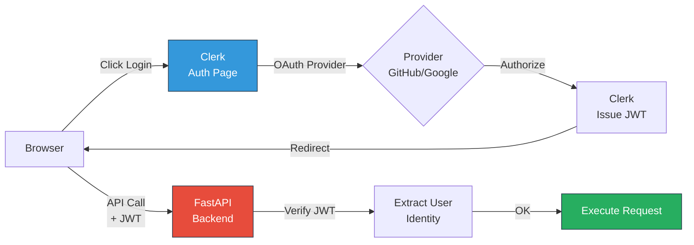

# Security Architecture - NabhaVerse Studio

**Version:** 1.0  
**Status:** Architecture Review  
**Last Updated:** 2026-07-07  
**Author:** Architecture Team  
**Project:** NabhaVerse Studio

---

## Table of Contents

1. [Purpose & Scope](#purpose--scope)
2. [Security Principles](#security-principles)
3. [Authentication](#authentication)
4. [Authorization](#authorization)
5. [Data Protection](#data-protection)
6. [API Security](#api-security)
7. [Infrastructure Security](#infrastructure-security)
8. [Compliance & Auditing](#compliance--auditing)
9. [Design Decisions](#design-decisions)
10. [Risks & Mitigations](#risks--mitigations)
11. [Future Improvements](#future-improvements)
12. [References](#references)

---

## Purpose & Scope

### Purpose
Define comprehensive security architecture for NabhaVerse Studio to protect creator data, ensure platform integrity, and maintain compliance.

### Scope
- Authentication and authorization
- Data encryption and protection
- API security and rate limiting
- Infrastructure and deployment security
- Compliance and auditing
- Incident response procedures

### Security Principles
- **Defense in Depth:** Multiple layers of security
- **Least Privilege:** Minimal access by default
- **Zero Trust:** Verify every request
- **Secure by Default:** Security in every design decision
- **Transparency:** Clear security policies

---

## Authentication

### Clerk SSO Integration



### Implementation

```python
from fastapi import Depends, HTTPException, status
from fastapi.security import HTTPBearer, HTTPAuthCredentials
import jwt
from app.core.config import get_settings

security = HTTPBearer()

async def get_current_user(
    credentials: HTTPAuthCredentials = Depends(security)
) -> dict:
    """Verify JWT token and extract user information.
    
    Args:
        credentials: Bearer token from request
        
    Returns:
        User information from token
        
    Raises:
        HTTPException: If token invalid or expired
    """
    settings = get_settings()
    token = credentials.credentials
    
    try:
        # Verify JWT signature
        payload = jwt.decode(
            token,
            settings.CLERK_PUBLIC_KEY,
            algorithms=["RS256"]
        )
        
        user_id: str = payload.get("sub")
        if user_id is None:
            raise HTTPException(
                status_code=status.HTTP_401_UNAUTHORIZED,
                detail="Invalid token"
            )
        
        return {
            "user_id": user_id,
            "email": payload.get("email"),
            "studio_id": payload.get("studio_id"),  # Multi-tenancy
            "roles": payload.get("roles", []),
        }
    except jwt.ExpiredSignatureError:
        raise HTTPException(
            status_code=status.HTTP_401_UNAUTHORIZED,
            detail="Token expired"
        )
    except jwt.JWTError:
        raise HTTPException(
            status_code=status.HTTP_401_UNAUTHORIZED,
            detail="Invalid token"
        )
```

### Multi-Tenancy in JWT

```python
# Clerk custom claims configuration
# Each token includes studio_id for multi-tenancy

def verify_studio_access(
    studio_id: str,
    current_user: dict = Depends(get_current_user)
) -> str:
    """Verify user has access to studio.
    
    Args:
        studio_id: Studio being accessed
        current_user: Current user from JWT
        
    Returns:
        Studio ID if access granted
        
    Raises:
        HTTPException: If user doesn't have access
    """
    if current_user["studio_id"] != studio_id:
        raise HTTPException(
            status_code=status.HTTP_403_FORBIDDEN,
            detail="Access denied"
        )
    return studio_id
```

---

## Authorization

### Role-Based Access Control (RBAC)

```python
from enum import Enum
from typing import List

class Role(str, Enum):
    """Studio roles."""
    OWNER = "owner"  # Full access
    EDITOR = "editor"  # Can edit content
    VIEWER = "viewer"  # Read-only access

ROLE_PERMISSIONS = {
    Role.OWNER: [
        "create_character",
        "update_character",
        "delete_character",
        "publish_episode",
        "manage_team",
        "access_settings",
    ],
    Role.EDITOR: [
        "create_character",
        "update_character",
        "publish_episode",
    ],
    Role.VIEWER: [
        "view_character",
        "view_episode",
    ],
}

async def require_permission(
    permission: str,
    current_user: dict = Depends(get_current_user)
) -> dict:
    """Check if user has required permission.
    
    Args:
        permission: Required permission
        current_user: Current user from JWT
        
    Returns:
        User if permission granted
        
    Raises:
        HTTPException: If user lacks permission
    """
    user_roles = current_user.get("roles", [])
    user_permissions = set()
    
    for role in user_roles:
        user_permissions.update(ROLE_PERMISSIONS.get(role, []))
    
    if permission not in user_permissions:
        raise HTTPException(
            status_code=status.HTTP_403_FORBIDDEN,
            detail=f"Permission required: {permission}"
        )
    
    return current_user

# Usage in routes
@router.post("/characters")
async def create_character(
    data: CharacterCreate,
    current_user: dict = Depends(require_permission("create_character")),
    db: AsyncSession = Depends(get_db)
):
    # Implementation
    pass
```

---

## Data Protection

### Encryption at Rest

```python
from cryptography.fernet import Fernet
import os

class EncryptionService:
    """Encrypt/decrypt sensitive data."""
    
    def __init__(self):
        key = os.environ.get("ENCRYPTION_KEY")
        self.cipher = Fernet(key)
    
    def encrypt(self, plaintext: str) -> str:
        """Encrypt data."""
        return self.cipher.encrypt(plaintext.encode()).decode()
    
    def decrypt(self, ciphertext: str) -> str:
        """Decrypt data."""
        return self.cipher.decrypt(ciphertext.encode()).decode()

# Database field encryption
class EncryptedColumn(Column):
    """SQLAlchemy column that auto-encrypts/decrypts."""
    
    def __init__(self, *args, encryption_service: EncryptionService, **kwargs):
        super().__init__(*args, **kwargs)
        self.encryption_service = encryption_service
    
    def set_value(self, value):
        return self.encryption_service.encrypt(value)
    
    def get_value(self, value):
        return self.encryption_service.decrypt(value)
```

### Encryption in Transit

- **HTTPS/TLS:** All connections encrypted with TLS 1.3+
- **HSTS:** HTTP Strict Transport Security headers
- **Certificate Pinning:** For critical API calls
- **API Keys:** Transmitted securely, never logged

---

## API Security

### Input Validation

```python
from pydantic import BaseModel, Field, validator
from typing import Optional

class CharacterCreate(BaseModel):
    """Validated character creation input."""
    
    name: str = Field(
        ...,
        min_length=1,
        max_length=100,
        description="Character name"
    )
    identity: str = Field(
        ...,
        min_length=10,
        max_length=5000,
        description="Character identity"
    )
    
    @validator('name')
    def validate_name(cls, v):
        """Validate character name."""
        # No special characters or SQL injection attempts
        if not v.replace(" ", "").isalpha():
            raise ValueError("Name must contain only letters and spaces")
        return v
    
    @validator('identity')
    def validate_identity(cls, v):
        """Validate identity description."""
        # Check for malicious content
        if len(v.split()) < 3:
            raise ValueError("Identity must be at least 3 words")
        return v
```

### Rate Limiting

```python
from slowapi import Limiter
from slowapi.util import get_remote_address
from slowapi.errors import RateLimitExceeded

limiter = Limiter(
    key_func=get_remote_address,
    default_limits=["200 per day", "50 per hour"],
    storage_uri="redis://localhost:6379"
)

@app.post("/characters")
@limiter.limit("10 per minute")  # API-specific limit
async def create_character(data: CharacterCreate):
    # Implementation
    pass
```

### CORS Configuration

```python
from fastapi.middleware.cors import CORSMiddleware

app.add_middleware(
    CORSMiddleware,
    allow_origins=[settings.FRONTEND_URL],  # Only specific origin
    allow_credentials=True,
    allow_methods=["GET", "POST", "PUT", "DELETE"],
    allow_headers=["Authorization", "Content-Type"],
    max_age=3600,
)
```

---

## Infrastructure Security

### Environment Security

```bash
# .env.example - No secrets here
API_URL=https://api.nabhaverse.com
FRONTEND_URL=https://app.nabhaverse.com

# Never commit secrets
# Use environment variables for:
# - DATABASE_URL
# - REDIS_URL
# - ENCRYPTION_KEY
# - API_KEYS (OpenAI, ElevenLabs, etc.)
# - JWT_SECRET
```

### Network Security

- **VPC:** Isolated network for database and cache
- **Security Groups:** Restrict traffic by port and IP
- **WAF:** Web Application Firewall on CDN
- **DDoS Protection:** Cloudflare or AWS Shield

### Secrets Management

```python
import os
from typing import Optional

class Settings:
    """Application settings with secret management."""
    
    # Public settings
    API_VERSION = "v1"
    ENVIRONMENT = os.environ.get("ENVIRONMENT", "development")
    
    # Secrets (from environment only, never hardcoded)
    DATABASE_URL: str = os.environ.get("DATABASE_URL", "")
    REDIS_URL: str = os.environ.get("REDIS_URL", "")
    CLERK_PUBLIC_KEY: str = os.environ.get("CLERK_PUBLIC_KEY", "")
    CLERK_SECRET_KEY: str = os.environ.get("CLERK_SECRET_KEY", "")
    OPENAI_API_KEY: str = os.environ.get("OPENAI_API_KEY", "")
    ENCRYPTION_KEY: str = os.environ.get("ENCRYPTION_KEY", "")
    
    def __init__(self):
        # Validate all secrets are set
        if self.ENVIRONMENT == "production":
            required_secrets = [
                "DATABASE_URL",
                "REDIS_URL",
                "CLERK_SECRET_KEY",
                "OPENAI_API_KEY",
                "ENCRYPTION_KEY"
            ]
            for secret in required_secrets:
                if not getattr(self, secret):
                    raise ValueError(f"Missing required secret: {secret}")
```

---

## Compliance & Auditing

### Audit Logging

```python
from datetime import datetime
from sqlalchemy import Column, String, DateTime, JSON

class AuditLog(Base):
    """Audit trail for all user actions."""
    
    __tablename__ = "audit_logs"
    
    id = Column(String, primary_key=True)
    studio_id = Column(String, index=True)
    user_id = Column(String, index=True)
    action = Column(String)  # create, update, delete
    entity_type = Column(String)  # character, episode, etc.
    entity_id = Column(String)
    changes = Column(JSON)  # What was changed
    timestamp = Column(DateTime, default=datetime.utcnow, index=True)
    ip_address = Column(String)
    user_agent = Column(String)

class AuditService:
    """Records all user actions for compliance."""
    
    async def log_action(
        self,
        studio_id: str,
        user_id: str,
        action: str,
        entity_type: str,
        entity_id: str,
        changes: dict,
        request
    ):
        """Log user action."""
        log = AuditLog(
            studio_id=studio_id,
            user_id=user_id,
            action=action,
            entity_type=entity_type,
            entity_id=entity_id,
            changes=changes,
            ip_address=request.client.host,
            user_agent=request.headers.get("user-agent")
        )
        await self.db.add(log)
        await self.db.commit()
```

### GDPR Compliance

- **Right to Access:** Export user data in machine-readable format
- **Right to Deletion:** Delete all user data on request
- **Data Portability:** Export data in standard formats
- **Consent Management:** Explicit opt-in for features

---

## Design Decisions

### 1. Why Clerk for Authentication?
**Decision:** Use Clerk SSO instead of custom auth

**Rationale:**
- ✅ Zero-trust security model
- ✅ GDPR and SOC 2 compliant
- ✅ OAuth provider integration
- ✅ Session management handled
- ✅ Reduces security attack surface
- ⚠️ Vendor lock-in, cost at scale

### 2. Why Role-Based Access Control?
**Decision:** Implement RBAC over attribute-based

**Rationale:**
- ✅ Simple and understandable
- ✅ Scales to enterprise
- ✅ Easy to audit
- ✅ Standard pattern
- ⚠️ Less flexible than ABAC

### 3. Why Field-Level Encryption?
**Decision:** Encrypt sensitive fields at database level

**Rationale:**
- ✅ Protected even if database breached
- ✅ Compliance with data protection regulations
- ✅ User control of encryption keys
- ⚠️ Performance overhead, key management complexity

---

## Risks & Mitigations

| Risk | Severity | Mitigation |
|------|----------|------------|
| **Token theft** | High | Short expiration, refresh tokens, secure storage |
| **SQL injection** | High | Parameterized queries, Pydantic validation |
| **XSS attacks** | High | Input sanitization, output encoding, CSP headers |
| **CSRF attacks** | Medium | CSRF tokens, SameSite cookies |
| **Unauthorized data access** | High | Encryption, RBAC, audit logging |
| **DDoS attacks** | Medium | CDN protection, rate limiting, WAF |

---

## Future Improvements

1. **2FA:** Two-factor authentication support
2. **SSO:** Enterprise SSO (SAML, OIDC)
3. **API Scopes:** Fine-grained API key permissions
4. **IP Whitelisting:** Restrict access by IP
5. **Security Keys:** Hardware security key support
6. **Intrusion Detection:** ML-based anomaly detection

---

## References

- [System Architecture](./SYSTEM_ARCHITECTURE.md)
- [API Guidelines](../api/API_GUIDELINES.md)
- [Deployment Architecture](./DEPLOYMENT_ARCHITECTURE.md)
- [Compliance Checklist](./COMPLIANCE.md)

---

**Last Updated:** 2026-07-07  
**Version:** 1.0  
**Status:** Approved for Implementation
