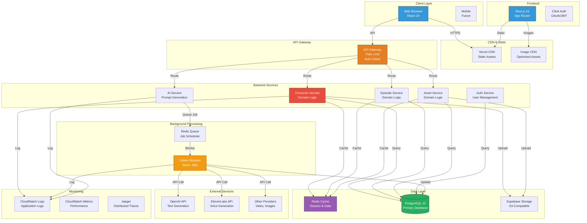
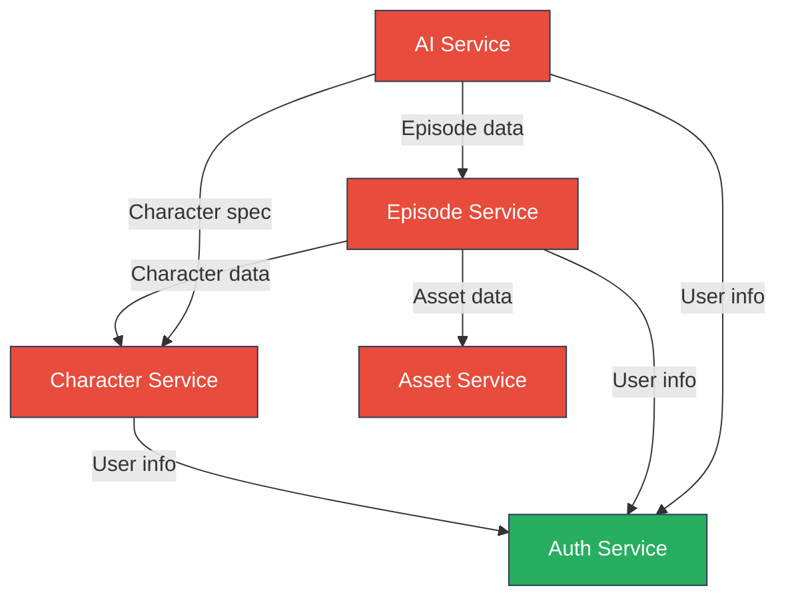
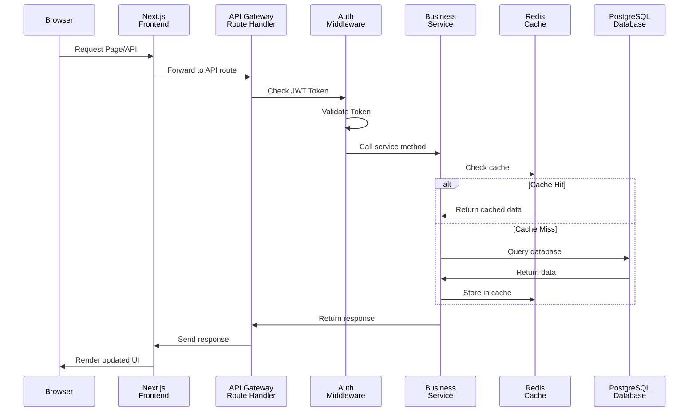
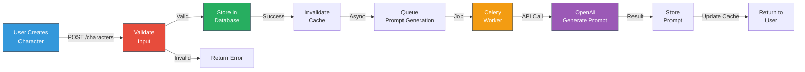

# System Architecture - NabhaVerse Studio

**Version:** 1.0  
**Status:** Architecture Review  
**Last Updated:** 2026-07-07  
**Author:** Architecture Team  

---

## Table of Contents

1. [Overview](#overview)
2. [Architecture Diagram](#architecture-diagram)
3. [System Components](#system-components)
4. [Component Relationships](#component-relationships)
5. [Request Flow](#request-flow)
6. [Data Flow](#data-flow)
7. [Deployment Model](#deployment-model)
8. [Design Decisions](#design-decisions)
9. [Risks & Mitigations](#risks--mitigations)
10. [Future Improvements](#future-improvements)

---

## Overview

### Purpose
Define the high-level system architecture for NabhaVerse Studio, including all major components, their responsibilities, and interactions.

### Scope
- System-level architecture for MVP (Milestones 1-2)
- Multi-tenant SaaS platform
- Global deployment with regional scaling
- Support for 1,000+ concurrent users initially, 10,000+ at scale

### Key Principles
- **Microservices-ready** but monolithic initially
- **Stateless services** for horizontal scaling
- **Event-driven** for asynchronous operations
- **Cache-first** for performance
- **Domain-driven** organization

---

## Architecture Diagram

### High-Level System Architecture



---

## System Components

### 1. Client Layer

#### Web Application (Next.js)
- **Responsibility:** Render UI, handle user interactions
- **Technology:** React 19, Next.js 16
- **Deployment:** Vercel (global CDN)
- **Key Features:**
  - Server-side rendering for SEO
  - Static generation for performance
  - API routes for middleware
  - Automatic code splitting

### 2. CDN & Static Assets

#### Vercel CDN
- **Responsibility:** Serve static assets globally
- **Deployment:** Automatic with Next.js
- **Features:**
  - Edge caching
  - Automatic compression
  - DDoS protection

#### Image CDN
- **Responsibility:** Optimize and serve images
- **Technology:** Vercel Image Optimization
- **Features:**
  - Automatic format conversion (WebP)
  - Responsive images
  - Lazy loading

### 3. Authentication Layer

#### Clerk
- **Responsibility:** User authentication and authorization
- **Features:**
  - OAuth providers (GitHub, Google, Microsoft)
  - Email/password authentication
  - Multi-factor authentication
  - Session management
  - Role-based access control

### 4. API Gateway

#### Purpose
- Rate limiting per user/API key
- Request authentication validation
- Request routing to services
- CORS handling
- Request/response logging

#### Implementation
- Next.js API routes (initially)
- Migrate to dedicated gateway (Kong, AWS API Gateway) at scale

### 5. Backend Services

Each service is independently deployable and scalable.

#### Character Service
- **Responsibility:** Character management, Master Profile
- **Endpoints:** Create, read, update, delete, version, search characters
- **Database:** Characters table
- **Cache:** Character profiles, relationships

#### Episode Service
- **Responsibility:** Episode lifecycle management
- **Endpoints:** Create, read, update, delete episodes, manage scenes
- **Database:** Episodes, Scenes tables
- **Cache:** Episode metadata

#### Asset Service
- **Responsibility:** Asset management and organization
- **Endpoints:** Upload, organize, search, delete assets
- **Database:** Assets, AssetTags tables
- **Storage:** Supabase Storage (S3-compatible)
- **Cache:** Asset metadata, search indexes

#### AI Service
- **Responsibility:** AI prompt generation and orchestration
- **Endpoints:** Generate prompts, get prompt history
- **Integrations:** OpenAI, ElevenLabs, Replicate, etc.
- **Queue Integration:** Async job processing

#### Auth Service
- **Responsibility:** User and studio management
- **Endpoints:** User profile, studio creation, team management
- **Database:** Users, Studios, TeamMembers tables
- **Integration:** Clerk webhooks

### 6. Data Layer

#### PostgreSQL Database
- **Responsibility:** Persistent data storage
- **Deployment:** Railway/Fly.io managed database
- **Features:**
  - Connection pooling (pgBouncer)
  - Read replicas for scaling
  - Automated backups
  - Point-in-time recovery

#### Redis Cache
- **Responsibility:** 
  - Session storage
  - Application cache
  - Rate limiting counters
  - Job queue
- **Deployment:** Railway/Fly.io managed Redis
- **Configuration:** TTL-based expiration

#### Supabase Storage
- **Responsibility:** Object storage for files
- **Types:** Character images, props, animations, audio
- **Features:**
  - S3-compatible API
  - Access control per object
  - CDN integration
  - Integrated with Clerk auth

### 7. Background Processing

#### Job Queue (Redis + Celery)
- **Responsibility:** 
  - Async job scheduling
  - Delayed execution
  - Job retry and dead-letter queue
- **Use Cases:**
  - Prompt generation
  - Email notifications
  - Batch operations
  - Media processing

#### Celery Workers
- **Responsibility:** Execute background jobs
- **Deployment:** Separate from main API
- **Scaling:** Independent worker count
- **Monitoring:** Job status tracking

### 8. External Integrations

#### AI Providers
- **OpenAI:** Text generation (GPT-4)
- **ElevenLabs:** Voice generation
- **Google Veo:** Video generation (future)
- **Replicate:** Image generation models
- **Fal.ai:** Serverless AI APIs

#### Monitoring Services
- **CloudWatch:** Logs and metrics
- **Sentry:** Error tracking
- **Jaeger:** Distributed tracing

---

## Component Relationships

### Dependency Graph



### Communication Patterns

| Pattern | Use Case | Example |
|---------|----------|----------|
| **Synchronous REST API** | Immediate response needed | GET /characters |
| **Asynchronous Job Queue** | Long-running operations | Generate prompt for character |
| **Event Streaming** | Real-time updates | Character updated → notify subscribers |
| **Cache** | Frequently accessed data | User preferences, settings |

---

## Request Flow

### Typical API Request Flow



---

## Data Flow

### Character Creation Flow



---

## Deployment Model

### Multi-Environment Architecture

| Environment | Purpose | Updates | Monitoring |
|-------------|---------|---------|------------|
| **Development** | Local development | Continuous | Minimal |
| **Staging** | Pre-production testing | Daily from main | Full |
| **Production** | Live users | On demand, via release | Full |

### Deployment Targets

- **Frontend:** Vercel (automatic on push to main)
- **Backend:** Railway/Fly.io (container deployment)
- **Database:** Managed PostgreSQL
- **Cache:** Managed Redis
- **Storage:** Supabase (serverless)

---

## Design Decisions

### 1. Why Next.js Frontend?
**Decision:** Next.js 16 with App Router

**Rationale:**
- ✅ Server-side rendering for SEO
- ✅ Static generation for performance
- ✅ API routes for serverless functions
- ✅ Automatic code splitting
- ✅ Built-in authentication support (NextAuth, Clerk)
- ✅ Zero-config deployment on Vercel

**Alternatives Considered:**
- SPA (React only): No SSR, poor SEO
- Remix: Good but less mature ecosystem
- Nuxt (Vue): Different ecosystem

### 2. Why FastAPI Backend?
**Decision:** FastAPI for backend services

**Rationale:**
- ✅ Native Python async/await
- ✅ Excellent for AI/ML workloads
- ✅ Built-in validation (Pydantic)
- ✅ Auto-generated OpenAPI documentation
- ✅ High performance (similar to Go/Rust)
- ✅ Easy integration with Celery for background jobs

**Alternatives Considered:**
- Node.js: Good but not ideal for AI workloads
- Django: Powerful but not async-first
- Go: High performance but different ecosystem

### 3. Why PostgreSQL?
**Decision:** PostgreSQL as primary database

**Rationale:**
- ✅ ACID compliance
- ✅ JSON support for flexible schemas
- ✅ Excellent for complex queries and relationships
- ✅ Proven at massive scale (Instagram, Spotify)
- ✅ Great tooling and community
- ✅ Cost-effective

**Alternatives Considered:**
- MongoDB: Good but ACID compliance issues at scale
- DynamoDB: Good but expensive at scale
- Firestore: Good but vendor lock-in

### 4. Why Redis for Cache & Queue?
**Decision:** Redis for both cache and job queue

**Rationale:**
- ✅ Sub-millisecond performance
- ✅ Reliable job queue (via Celery)
- ✅ Built-in TTL for cache expiration
- ✅ Pub/sub for real-time features
- ✅ Data structures (strings, hashes, sets, lists)
- ✅ Seamless integration with Python

**Alternatives Considered:**
- Memcached: No job queue, simpler
- RabbitMQ: Good but more complex
- AWS SQS: Good but limited queue features

### 5. Why Adapter Pattern for AI?
**Decision:** Abstract AI providers behind interfaces

**Rationale:**
- ✅ Easy to switch providers without code changes
- ✅ Enables self-hosted models in future
- ✅ Cost optimization (pick cheapest provider)
- ✅ Fallback mechanisms for reliability
- ✅ Easy to add new providers

**Implementation:**
```python
class AIProvider(ABC):
    @abstractmethod
    async def generate_prompt(self, spec: Dict) -> str:
        pass

class OpenAIProvider(AIProvider):
    async def generate_prompt(self, spec: Dict) -> str:
        # OpenAI implementation
        pass
```

---

## Risks & Mitigations

| Risk | Severity | Likelihood | Mitigation |
|------|----------|------------|------------|
| **AI provider failure** | High | Medium | Multiple providers, fallback logic, queue retry |
| **Database connection limits** | High | Low | Connection pooling, read replicas, caching |
| **Cost explosion (AI)** | High | Medium | Rate limiting, provider selection, cost tracking |
| **Cache invalidation** | Medium | High | TTL-based, event-driven invalidation |
| **Security breach** | High | Low | Auth/authz, encryption, audit logs, SOC 2 |
| **Data loss** | High | Very Low | Backups, point-in-time recovery |
| **Concurrent user spike** | Medium | Medium | Load testing, auto-scaling, rate limiting |

---

## Future Improvements

### Phase 2 (Post-MVP)
1. **Microservices:** Break services into separate deployments
2. **Service Mesh:** Istio for service communication
3. **Message Queue:** Kafka for event streaming
4. **GraphQL:** Alternative to REST API
5. **Real-time Collaboration:** WebSockets for live editing

### Phase 3 (Long-term)
1. **Multi-region:** Global deployment with latency optimization
2. **Blockchain:** For asset verification and ownership
3. **Community Features:** Marketplace, sharing, collaboration
4. **Mobile App:** Native iOS/Android apps
5. **Self-hosted:** On-premise deployment option

---

## References

- [Frontend Architecture](./FRONTEND_ARCHITECTURE.md)
- [Backend Architecture](./BACKEND_ARCHITECTURE.md)
- [Deployment Architecture](./DEPLOYMENT_ARCHITECTURE.md)
- [Decision Log](./DECISION_LOG.md)

---

**Last Updated:** 2026-07-07  
**Version:** 1.0  
**Status:** Approved for Implementation
