# NabhaVerse Studio — Sprint 2: Database Architecture & Domain Modeling

**Version:** 1.0  
**Date:** 2026-07-07  
**Status:** Review Pending  
**Sprint:** 2 — Database Architecture & Domain Modeling

---

## Table of Contents

1. [Domain Model](#1-domain-model)
   - 1.1 [Business Domains](#11-business-domains)
   - 1.2 [Aggregate Roots](#12-aggregate-roots)
   - 1.3 [Bounded Contexts](#13-bounded-contexts)
2. [Entity Relationship Diagram](#2-entity-relationship-diagram)
3. [Database Design Document](#3-database-design-document)
   - 3.1 [Database Architecture](#31-database-architecture)
   - 3.2 [Naming Conventions](#32-naming-conventions)
   - 3.3 [Primary Keys](#33-primary-keys)
   - 3.4 [Foreign Keys](#34-foreign-keys)
   - 3.5 [Constraints](#35-constraints)
   - 3.6 [Indexing Strategy](#36-indexing-strategy)
   - 3.7 [Soft Delete Strategy](#37-soft-delete-strategy)
   - 3.8 [Audit Logging](#38-audit-logging)
   - 3.9 [Multi-Tenancy Strategy](#39-multi-tenancy-strategy)
   - 3.10 [Versioning Strategy](#310-versioning-strategy)
   - 3.11 [Backup & Recovery Considerations](#311-backup--recovery-considerations)
4. [Database Entities](#4-database-entities)
5. [Architecture Review](#5-architecture-review)

---

## 1. Domain Model

### 1.1 Business Domains

NabhaVerse Studio is organized into eight primary business domains, each encapsulating a distinct area of responsibility:

| # | Domain | Responsibility |
|---|--------|----------------|
| 1 | **Identity & Access** | User authentication, authorization, roles, studio membership |
| 2 | **Studio Management** | Multi-tenant studio workspaces, projects, configuration |
| 3 | **Creative Production** | Characters, master profiles, worlds, locations |
| 4 | **Episode Production** | Episodes, scenes, scene composition |
| 5 | **Asset Management** | Asset library, versioning, categorization |
| 6 | **AI & Prompt Engineering** | Prompt library, AI specifications, voice profiles |
| 7 | **Production Operations** | Pipelines, tasks, workflow management |
| 8 | **Publishing & Analytics** | Publications, analytics events, engagement metrics |
| 9 | **Collaboration** | Notifications, comments, tagging |

---

### 1.2 Aggregate Roots

An **Aggregate Root** is the entry point for a cluster of related entities that must be kept consistent together. External entities reference only the aggregate root, never internal members directly.

| Aggregate Root | Internal Entities | Domain |
|----------------|-------------------|--------|
| **User** | — | Identity & Access |
| **Studio** | StudioMember | Studio Management |
| **Project** | — | Studio Management |
| **Character** | CharacterMasterProfile, CharacterDocument, CharacterRelationship | Creative Production |
| **World** | Location | Creative Production |
| **Episode** | Scene, SceneCharacter, SceneLocation | Episode Production |
| **Asset** | AssetVersion | Asset Management |
| **PromptEntry** | — | AI & Prompt Engineering |
| **VoiceProfile** | — | AI & Prompt Engineering |
| **ProductionPipeline** | PipelineStage | Production Operations |
| **Task** | — | Production Operations |
| **Publication** | — | Publishing & Analytics |
| **AnalyticsEvent** | — | Publishing & Analytics |
| **Notification** | — | Collaboration |
| **Comment** | — | Collaboration |
| **Tag** | — | Collaboration |

---

### 1.3 Bounded Contexts

Each bounded context defines a linguistic and logical boundary within which a model is consistent.

#### Context: Identity & Access
- Owns `users`, `studio_members`
- Coordinates with Studio Management to validate membership
- External systems receive only `user_id` references

#### Context: Studio Management
- Owns `studios`, `projects`
- All other domains carry `studio_id` as a tenant discriminator
- Bounded context boundary: only Studio Management context may create or deactivate a studio

#### Context: Creative Production
- Owns `characters`, `character_master_profiles`, `character_documents`, `worlds`, `locations`, `character_relationships`
- Characters are the primary creative asset; Master Profile is the single source of truth
- Exposes character identity to Episode Production via `character_id` only

#### Context: Episode Production
- Owns `episodes`, `scenes`, `scene_characters`, `scene_locations`, `episode_characters`, `episode_locations`
- Consumes character and location references from Creative Production
- Scenes are internal to episodes; external code references episodes, not individual scenes directly

#### Context: Asset Management
- Owns `assets`, `asset_versions`, `asset_tags`
- Assets are consumed by Creative Production and Episode Production via reference
- Version management is internal to this context

#### Context: AI & Prompt Engineering
- Owns `prompt_library`, `voice_profiles`
- Prompts generated from Creative Production specs, stored independently
- Voice profiles are linked to characters but owned by this context

#### Context: Production Operations
- Owns `production_pipelines`, `pipeline_stages`, `tasks`
- Consumes references from all producing contexts (episodes, characters, assets)
- Pipeline logic is isolated: other contexts do not know pipeline internals

#### Context: Publishing & Analytics
- Owns `publications`, `analytics_events`
- Publications reference episodes; analytics events are append-only
- No writes back to Episode Production

#### Context: Collaboration
- Owns `notifications`, `comments`, `tags`
- Polymorphic by design: comments and tags attach to any entity via `target_type` + `target_id`
- Stateless with respect to business logic

---

## 2. Entity Relationship Diagram

The following ERD uses Mermaid notation and covers all core entities and their primary relationships. Junction tables for many-to-many associations are shown explicitly.

```mermaid
erDiagram
    %% ─────────────────────────────────────────────────────────────
    %% IDENTITY & ACCESS
    %% ─────────────────────────────────────────────────────────────
    users {
        uuid id PK
        string clerk_user_id UK
        string email UK
        string display_name
        string avatar_url
        string timezone
        string locale
        boolean is_active
        timestamp created_at
        timestamp updated_at
        timestamp deleted_at
    }

    studios {
        uuid id PK
        string name
        string slug UK
        string description
        string logo_url
        string plan
        boolean is_active
        uuid created_by FK
        timestamp created_at
        timestamp updated_at
        timestamp deleted_at
    }

    studio_members {
        uuid id PK
        uuid studio_id FK
        uuid user_id FK
        string role
        timestamp joined_at
        timestamp created_at
        timestamp updated_at
    }

    projects {
        uuid id PK
        uuid studio_id FK
        string name
        string description
        string status
        uuid created_by FK
        timestamp created_at
        timestamp updated_at
        timestamp deleted_at
    }

    %% ─────────────────────────────────────────────────────────────
    %% CREATIVE PRODUCTION
    %% ─────────────────────────────────────────────────────────────
    characters {
        uuid id PK
        uuid studio_id FK
        uuid project_id FK
        string name
        string slug
        string role
        string story_role
        string status
        boolean is_archived
        uuid created_by FK
        timestamp created_at
        timestamp updated_at
        timestamp deleted_at
    }

    character_master_profiles {
        uuid id PK
        uuid character_id FK
        jsonb identity
        jsonb personality
        jsonb visual_identity
        jsonb expressions
        jsonb poses
        jsonb animation_notes
        jsonb voice_spec
        jsonb sound_design
        jsonb environment_prefs
        jsonb educational_role
        jsonb rendering_rules
        jsonb ai_rules
        jsonb approval_checklist
        integer version
        uuid created_by FK
        timestamp created_at
        timestamp updated_at
    }

    character_documents {
        uuid id PK
        uuid character_id FK
        string document_type
        string title
        jsonb content
        string status
        integer version
        uuid created_by FK
        timestamp created_at
        timestamp updated_at
        timestamp deleted_at
    }

    character_relationships {
        uuid id PK
        uuid studio_id FK
        uuid from_character_id FK
        uuid to_character_id FK
        string relationship_type
        string description
        timestamp created_at
        timestamp updated_at
    }

    worlds {
        uuid id PK
        uuid studio_id FK
        uuid project_id FK
        string name
        string slug
        string description
        string world_type
        uuid created_by FK
        timestamp created_at
        timestamp updated_at
        timestamp deleted_at
    }

    locations {
        uuid id PK
        uuid world_id FK
        uuid studio_id FK
        string name
        string slug
        string description
        string environment_type
        jsonb structures
        jsonb nature_elements
        jsonb vehicles
        jsonb props
        jsonb lighting_conditions
        jsonb materials_textures
        jsonb ai_spec
        uuid created_by FK
        timestamp created_at
        timestamp updated_at
        timestamp deleted_at
    }

    %% ─────────────────────────────────────────────────────────────
    %% EPISODE PRODUCTION
    %% ─────────────────────────────────────────────────────────────
    episodes {
        uuid id PK
        uuid studio_id FK
        uuid project_id FK
        uuid world_id FK
        string title
        string slug
        string logline
        text themes
        string status
        integer episode_number
        integer season_number
        uuid created_by FK
        timestamp created_at
        timestamp updated_at
        timestamp deleted_at
    }

    episode_characters {
        uuid id PK
        uuid episode_id FK
        uuid character_id FK
        timestamp created_at
    }

    episode_locations {
        uuid id PK
        uuid episode_id FK
        uuid location_id FK
        timestamp created_at
    }

    scenes {
        uuid id PK
        uuid episode_id FK
        uuid studio_id FK
        integer scene_number
        string title
        text description
        text dialogue
        text stage_directions
        integer duration_seconds
        string status
        uuid created_by FK
        timestamp created_at
        timestamp updated_at
        timestamp deleted_at
    }

    scene_characters {
        uuid id PK
        uuid scene_id FK
        uuid character_id FK
        text notes
        timestamp created_at
    }

    scene_locations {
        uuid id PK
        uuid scene_id FK
        uuid location_id FK
        timestamp created_at
    }

    %% ─────────────────────────────────────────────────────────────
    %% ASSET MANAGEMENT
    %% ─────────────────────────────────────────────────────────────
    assets {
        uuid id PK
        uuid studio_id FK
        uuid project_id FK
        string name
        string description
        string asset_type
        string status
        string approval_status
        uuid created_by FK
        timestamp created_at
        timestamp updated_at
        timestamp deleted_at
    }

    asset_versions {
        uuid id PK
        uuid asset_id FK
        integer version_number
        string file_url
        string file_key
        string mime_type
        bigint file_size_bytes
        string checksum
        text change_notes
        boolean is_current
        uuid uploaded_by FK
        timestamp created_at
    }

    %% ─────────────────────────────────────────────────────────────
    %% AI & PROMPT ENGINEERING
    %% ─────────────────────────────────────────────────────────────
    prompt_library {
        uuid id PK
        uuid studio_id FK
        string name
        string prompt_type
        string category
        text prompt_text
        text negative_prompt_text
        jsonb style_modifiers
        integer usage_count
        boolean is_active
        integer version
        uuid created_by FK
        timestamp created_at
        timestamp updated_at
        timestamp deleted_at
    }

    voice_profiles {
        uuid id PK
        uuid studio_id FK
        uuid character_id FK
        string name
        string provider
        string provider_voice_id
        string age_range
        string accent
        string tone
        jsonb speech_patterns
        jsonb audio_settings
        boolean is_active
        uuid created_by FK
        timestamp created_at
        timestamp updated_at
        timestamp deleted_at
    }

    %% ─────────────────────────────────────────────────────────────
    %% PRODUCTION OPERATIONS
    %% ─────────────────────────────────────────────────────────────
    production_pipelines {
        uuid id PK
        uuid studio_id FK
        uuid project_id FK
        string name
        string description
        string pipeline_type
        boolean is_active
        uuid created_by FK
        timestamp created_at
        timestamp updated_at
        timestamp deleted_at
    }

    pipeline_stages {
        uuid id PK
        uuid pipeline_id FK
        string name
        string description
        integer stage_order
        string stage_type
        jsonb config
        timestamp created_at
        timestamp updated_at
    }

    tasks {
        uuid id PK
        uuid studio_id FK
        uuid pipeline_id FK
        uuid pipeline_stage_id FK
        string title
        text description
        string status
        string priority
        string target_type
        uuid target_id
        uuid assignee_id FK
        uuid created_by FK
        timestamp due_date
        timestamp completed_at
        timestamp created_at
        timestamp updated_at
        timestamp deleted_at
    }

    %% ─────────────────────────────────────────────────────────────
    %% PUBLISHING & ANALYTICS
    %% ─────────────────────────────────────────────────────────────
    publications {
        uuid id PK
        uuid studio_id FK
        uuid episode_id FK
        string status
        string platform
        string publish_url
        jsonb metadata
        uuid published_by FK
        timestamp published_at
        timestamp created_at
        timestamp updated_at
        timestamp deleted_at
    }

    analytics_events {
        uuid id PK
        uuid studio_id FK
        uuid user_id FK
        string event_type
        string target_type
        uuid target_id
        jsonb properties
        string ip_address
        string user_agent
        timestamp occurred_at
    }

    %% ─────────────────────────────────────────────────────────────
    %% COLLABORATION
    %% ─────────────────────────────────────────────────────────────
    tags {
        uuid id PK
        uuid studio_id FK
        string name
        string slug
        string color
        string category
        uuid created_by FK
        timestamp created_at
        timestamp updated_at
        timestamp deleted_at
    }

    taggables {
        uuid id PK
        uuid tag_id FK
        string target_type
        uuid target_id
        timestamp created_at
    }

    comments {
        uuid id PK
        uuid studio_id FK
        string target_type
        uuid target_id
        uuid parent_comment_id FK
        text body
        boolean is_resolved
        uuid created_by FK
        timestamp created_at
        timestamp updated_at
        timestamp deleted_at
    }

    notifications {
        uuid id PK
        uuid studio_id FK
        uuid recipient_id FK
        string notification_type
        string title
        text body
        string target_type
        uuid target_id
        boolean is_read
        timestamp read_at
        timestamp created_at
    }

    %% ─────────────────────────────────────────────────────────────
    %% RELATIONSHIPS
    %% ─────────────────────────────────────────────────────────────

    users ||--o{ studio_members : "belongs to"
    studios ||--o{ studio_members : "has"
    users ||--o{ studios : "creates"
    studios ||--o{ projects : "contains"

    studios ||--o{ characters : "owns"
    projects ||--o{ characters : "groups"
    characters ||--|| character_master_profiles : "has profile"
    characters ||--o{ character_documents : "has documents"
    characters ||--o{ character_relationships : "from"
    characters ||--o{ character_relationships : "to"
    characters ||--o{ voice_profiles : "has voices"

    studios ||--o{ worlds : "owns"
    worlds ||--o{ locations : "contains"

    studios ||--o{ episodes : "owns"
    projects ||--o{ episodes : "groups"
    worlds ||--o{ episodes : "set in"
    episodes ||--o{ scenes : "contains"
    episodes ||--o{ episode_characters : "features"
    episodes ||--o{ episode_locations : "uses"
    characters ||--o{ episode_characters : "appears in"
    locations ||--o{ episode_locations : "featured in"
    scenes ||--o{ scene_characters : "includes"
    scenes ||--o{ scene_locations : "set at"
    characters ||--o{ scene_characters : "appears in"
    locations ||--o{ scene_locations : "used in"

    studios ||--o{ assets : "owns"
    assets ||--o{ asset_versions : "has versions"

    studios ||--o{ prompt_library : "owns"
    studios ||--o{ production_pipelines : "has"
    production_pipelines ||--o{ pipeline_stages : "contains"
    production_pipelines ||--o{ tasks : "drives"
    pipeline_stages ||--o{ tasks : "owns"

    episodes ||--o{ publications : "published as"
    studios ||--o{ analytics_events : "generates"

    studios ||--o{ tags : "defines"
    tags ||--o{ taggables : "applied via"
    studios ||--o{ notifications : "sends"
    users ||--o{ notifications : "receives"
    comments ||--o{ comments : "parent of"
```



---

## 3. Database Design Document

### 3.1 Database Architecture

#### Primary Database
- **Engine:** PostgreSQL 15+
- **Role:** Authoritative store for all structured data
- **Configuration:** Single primary with read replicas for scale
- **Extensions required:**
  - `uuid-ossp` — UUID generation
  - `pgcrypto` — cryptographic functions
  - `pg_trgm` — trigram indexes for fuzzy text search
  - `btree_gist` — GiST index support for constraint exclusion
  - `pg_stat_statements` — query performance monitoring

#### Caching Layer
- **Engine:** Redis 7+
- **Role:** Session cache, API response cache, job queue (Celery broker), rate-limiting counters
- **Eviction policy:** `allkeys-lru` for cache; `noeviction` for queue data

#### Search
- Phase 1 (MVP): PostgreSQL full-text search using `tsvector` columns and `GIN` indexes
- Phase 2 (Scale): Migrate to dedicated search engine (OpenSearch / Typesense) via adapter pattern

#### Object Storage
- **Provider:** Supabase Storage (S3-compatible)
- **Role:** Binary assets (images, models, audio, video)
- **Reference pattern:** Database stores `file_url` (CDN URL) + `file_key` (storage key); binary data never stored in PostgreSQL

#### Architecture Diagram (Conceptual)

```
┌──────────────────────────────────────────────────────┐
│                  Application Layer                    │
│           FastAPI + SQLAlchemy + Pydantic             │
└────────────────────────┬─────────────────────────────┘
                         │
          ┌──────────────┼──────────────┐
          ▼              ▼              ▼
   ┌─────────────┐  ┌─────────┐  ┌──────────────┐
   │ PostgreSQL  │  │  Redis  │  │   Supabase   │
   │  (Primary) ◄├──┤ Cache / │  │   Storage    │
   │             │  │  Queue  │  │  (S3-compat) │
   └──────┬──────┘  └─────────┘  └──────────────┘
          │
   ┌──────▼──────┐
   │  Read       │
   │  Replica(s) │
   └─────────────┘
```

---

### 3.2 Naming Conventions

#### Table Names
- Plural, lowercase, `snake_case`
- Examples: `users`, `studio_members`, `character_master_profiles`, `asset_versions`
- Junction tables: combine both table names in alphabetical order — `episode_characters`, `scene_locations`, `taggables` (when polymorphic)

#### Column Names
- Lowercase `snake_case`
- No abbreviations except well-known ones (`url`, `id`, `sfx`)
- Boolean columns prefixed with `is_` or `has_`: `is_active`, `is_archived`, `is_read`, `has_watermark`
- Timestamp columns suffixed with `_at`: `created_at`, `updated_at`, `deleted_at`, `published_at`, `completed_at`
- Foreign key columns: `{singular_table_name}_id` — `studio_id`, `character_id`, `episode_id`
- Enum-like string columns use descriptive noun: `status`, `role`, `priority`, `document_type`
- JSONB columns named after their semantic group: `identity`, `personality`, `visual_identity`, `ai_rules`, `config`, `metadata`, `properties`

#### Index Names
Pattern: `idx_{table}_{column(s)}`  
Examples: `idx_characters_studio_id`, `idx_assets_studio_id_asset_type`, `idx_scenes_episode_id`

#### Unique Constraint Names
Pattern: `uq_{table}_{column(s)}`  
Examples: `uq_users_email`, `uq_studios_slug`, `uq_studio_members_studio_user`

#### Foreign Key Constraint Names
Pattern: `fk_{table}_{referenced_table}`  
Examples: `fk_characters_studios`, `fk_scenes_episodes`

#### Check Constraint Names
Pattern: `chk_{table}_{description}`  
Examples: `chk_tasks_status_valid`, `chk_assets_file_size_positive`

---

### 3.3 Primary Keys

**Strategy: UUID v4**

- All primary keys are `UUID` type, generated by the database using `gen_random_uuid()` (PostgreSQL 13+) or `uuid_generate_v4()` (uuid-ossp)
- Column name: always `id`
- Rationale:
  - Globally unique across tables and environments — safe for distributed generation
  - No sequential leakage of record counts to clients
  - Merge-safe when consolidating tenants or migrating environments
  - Consistent type across all tables simplifies ORM configuration

**Future consideration:** UUID v7 (time-ordered) provides better B-tree index locality and can replace UUID v4 for high-write tables (`analytics_events`, `notifications`) when sequential insert performance is critical. This is a non-breaking upgrade.

---

### 3.4 Foreign Keys

- All foreign keys are explicit database-level constraints, not only enforced in the ORM
- Naming convention: `fk_{source_table}_{target_table}` (see §3.2)
- **Default action:** `ON DELETE RESTRICT` — prevents orphan records by default; explicit exceptions listed below
- **Cascade rules:**

| Relationship | ON DELETE | Rationale |
|---|---|---|
| `studio_members.studio_id → studios.id` | `CASCADE` | Membership is meaningless without studio |
| `studio_members.user_id → users.id` | `CASCADE` | User removal cleans memberships |
| `characters.studio_id → studios.id` | `RESTRICT` | Hard delete studios separately |
| `character_master_profiles.character_id → characters.id` | `CASCADE` | Profile is part of character aggregate |
| `character_documents.character_id → characters.id` | `CASCADE` | Documents owned by character |
| `locations.world_id → worlds.id` | `RESTRICT` | Locations may survive world restructuring |
| `scenes.episode_id → episodes.id` | `CASCADE` | Scenes are internal to episodes |
| `scene_characters.scene_id → scenes.id` | `CASCADE` | Junction row owned by scene |
| `scene_locations.scene_id → scenes.id` | `CASCADE` | Junction row owned by scene |
| `asset_versions.asset_id → assets.id` | `CASCADE` | Versions are internal to asset |
| `pipeline_stages.pipeline_id → production_pipelines.id` | `CASCADE` | Stages owned by pipeline |
| `notifications.recipient_id → users.id` | `CASCADE` | Notifications meaningless without user |
| `comments.parent_comment_id → comments.id` | `SET NULL` | Parent removal does not delete replies |

---

### 3.5 Constraints

#### NOT NULL
- All primary keys, foreign keys, and `status`/`role` discriminator columns are `NOT NULL`
- `created_at`, `updated_at` are `NOT NULL` with default `now()`
- Nullable fields: `deleted_at`, `project_id` (characters may exist outside a project), `due_date`, `avatar_url`, `description`

#### UNIQUE
| Table | Unique Constraint |
|---|---|
| `users` | `email`, `clerk_user_id` |
| `studios` | `slug` |
| `studio_members` | `(studio_id, user_id)` |
| `projects` | `(studio_id, name)` |
| `characters` | `(studio_id, slug)` |
| `worlds` | `(studio_id, slug)` |
| `locations` | `(world_id, slug)` |
| `episodes` | `(studio_id, slug)` |
| `tags` | `(studio_id, slug)` |
| `asset_versions` | `(asset_id, version_number)` |
| `pipeline_stages` | `(pipeline_id, stage_order)` |

#### CHECK
| Table | Column | Constraint |
|---|---|---|
| `tasks` | `status` | `IN ('backlog', 'todo', 'in_progress', 'review', 'done', 'cancelled')` |
| `tasks` | `priority` | `IN ('low', 'medium', 'high', 'urgent')` |
| `episodes` | `status` | `IN ('idea', 'outline', 'script', 'storyboard', 'in_production', 'post_production', 'complete', 'published')` |
| `assets` | `approval_status` | `IN ('pending', 'approved', 'rejected')` |
| `studio_members` | `role` | `IN ('owner', 'admin', 'editor', 'viewer')` |
| `publications` | `status` | `IN ('draft', 'scheduled', 'published', 'unpublished')` |
| `asset_versions` | `file_size_bytes` | `> 0` |
| `scenes` | `scene_number` | `> 0` |
| `episodes` | `episode_number` | `> 0` |
| `episodes` | `season_number` | `>= 1` |
| `character_master_profiles` | `version` | `>= 1` |
| `prompt_library` | `usage_count` | `>= 0` |

---

### 3.6 Indexing Strategy

#### Baseline Indexes (all tables)
Every table gets these indexes automatically:
- Primary key index (B-tree, created by `PRIMARY KEY` constraint)
- `deleted_at` — partial index `WHERE deleted_at IS NULL` on all soft-delete tables to restrict queries to live rows

#### Foreign Key Indexes
All foreign key columns are indexed (PostgreSQL does not auto-index FKs):
- `characters(studio_id)`, `characters(project_id)`, `characters(created_by)`
- `episodes(studio_id)`, `episodes(project_id)`, `episodes(world_id)`
- `scenes(episode_id)`, `scene_characters(scene_id)`, `scene_characters(character_id)`
- `assets(studio_id)`, `asset_versions(asset_id)`
- `tasks(studio_id)`, `tasks(pipeline_id)`, `tasks(assignee_id)`
- All other FK columns follow the same pattern

#### Composite Indexes (query-driven)
| Table | Index Columns | Rationale |
|---|---|---|
| `characters` | `(studio_id, status)` | Filter characters by status within studio |
| `characters` | `(studio_id, is_archived)` | Separate archived from active |
| `episodes` | `(studio_id, status)` | Filter episodes by production status |
| `episodes` | `(studio_id, season_number, episode_number)` | Ordered episode lists |
| `tasks` | `(studio_id, assignee_id, status)` | Task board queries per assignee |
| `tasks` | `(pipeline_id, status)` | Pipeline stage task counts |
| `assets` | `(studio_id, asset_type, status)` | Filtered asset library browse |
| `analytics_events` | `(studio_id, occurred_at)` | Time-series analytics queries |
| `analytics_events` | `(target_type, target_id, occurred_at)` | Per-entity analytics |
| `notifications` | `(recipient_id, is_read, created_at)` | Unread notification feed |
| `prompt_library` | `(studio_id, prompt_type, is_active)` | Active prompt lookup by type |
| `asset_versions` | `(asset_id, is_current)` | Current version lookup |

#### Full-Text Search Indexes (Phase 1 — PostgreSQL FTS)
| Table | Indexed Columns | Index Type |
|---|---|---|
| `characters` | `name`, `role` | `GIN` on `tsvector` |
| `assets` | `name`, `description` | `GIN` on `tsvector` |
| `episodes` | `title`, `logline` | `GIN` on `tsvector` |
| `prompt_library` | `name`, `prompt_text` | `GIN` on `tsvector` |
| `locations` | `name`, `description` | `GIN` on `tsvector` |
| `tags` | `name` | `GIN` on `tsvector` |

#### JSONB Indexes (selective)
| Table | JSONB Column | Path | Index Type | Rationale |
|---|---|---|---|---|
| `character_master_profiles` | `ai_rules` | `positive_prompts` | `GIN` | Prompt search within profiles |
| `analytics_events` | `properties` | — | `GIN` | Ad-hoc analytics filtering |
| `tasks` | — | `target_type`, `target_id` | Composite on extracted columns | Polymorphic task lookup |

---

### 3.7 Soft Delete Strategy

**Mechanism:** `deleted_at TIMESTAMP WITH TIME ZONE NULL`

- All user-facing entities include `deleted_at`
- A record is considered **deleted** when `deleted_at IS NOT NULL`
- **All application queries** must include `WHERE deleted_at IS NULL` — enforced at the repository/service layer
- A partial index `WHERE deleted_at IS NULL` is created on every soft-deletable table to keep these queries fast

**Hard Delete Exceptions** (junction/log tables that are not user-facing):
- `scene_characters`, `scene_locations`, `episode_characters`, `episode_locations` — physically deleted when the association is removed
- `analytics_events`, `notifications` — not deletable by users; notifications may be archived in place via `is_read`
- `asset_versions` — soft deleted only (an `asset_version` must remain retrievable for audit even if superseded)

**Purge Policy:**
- Soft-deleted records older than 90 days are eligible for physical purge by a scheduled background job
- Before purge, a snapshot is exported to cold storage (S3 Glacier) for compliance
- Cascade-purge respects FK cascade rules defined in §3.4

**Restoration:**
- Any soft-deleted record can be restored within the 90-day retention window by setting `deleted_at = NULL`
- Restoration also restores cascade-deleted children where `deleted_at` was set in the same transaction (tracked via `deleted_in_tx` column, added if needed)

---

### 3.8 Audit Logging

#### Strategy: Dual-layer

**Layer 1 — Application timestamps (on every table)**

Every table includes:
```
created_at    TIMESTAMP WITH TIME ZONE NOT NULL DEFAULT now()
updated_at    TIMESTAMP WITH TIME ZONE NOT NULL DEFAULT now()
created_by    UUID REFERENCES users(id)  -- NULL for system-generated
```

`updated_at` is maintained by a database trigger `set_updated_at()` that fires on every `UPDATE`.

**Layer 2 — Audit log table (append-only)**

A separate `audit_logs` table records all mutations to key business entities:

| Column | Type | Description |
|---|---|---|
| `id` | UUID | Audit record ID |
| `studio_id` | UUID | Tenant scope |
| `user_id` | UUID | Actor (NULL for system) |
| `action` | VARCHAR | `INSERT`, `UPDATE`, `DELETE`, `RESTORE` |
| `target_table` | VARCHAR | Name of affected table |
| `target_id` | UUID | PK of affected record |
| `old_values` | JSONB | Previous column values (UPDATE/DELETE) |
| `new_values` | JSONB | New column values (INSERT/UPDATE) |
| `ip_address` | INET | Request IP (from application context) |
| `user_agent` | TEXT | Request user agent |
| `occurred_at` | TIMESTAMP WITH TIME ZONE | When the change happened |

**Entities audited:** `users`, `studios`, `characters`, `character_master_profiles`, `episodes`, `assets`, `productions_pipelines`, `tasks`, `publications`

**Exclusions:** `analytics_events`, `notifications`, `comments` (these are themselves event records)

**Audit log is immutable** — no UPDATE or DELETE permitted. Retention: minimum 2 years.

---

### 3.9 Multi-Tenancy Strategy

**Strategy: Shared Schema with Tenant Discriminator Column**

- Every business table carries a `studio_id UUID NOT NULL` column
- All queries must include `WHERE studio_id = :current_studio_id`
- **Row-Level Security (RLS)** is enabled at the PostgreSQL level for all tenant-scoped tables:
  - Policy: `USING (studio_id = current_setting('app.current_studio_id')::uuid)`
  - Application sets `SET LOCAL app.current_studio_id = '...'` at the start of each request transaction
- RLS provides a database-enforced secondary safety net beyond application-layer filtering

**Why Shared Schema (not separate schemas/databases)?**

| Concern | Rationale |
|---|---|
| Operational simplicity | Single migration path; no per-tenant schema management |
| Cross-tenant analytics | Platform-level analytics can query across studios |
| Cost efficiency | Scales to thousands of tenants without schema explosion |
| Migration | Single Alembic migration covers all tenants |

**Tenant Isolation Boundaries:**
- A user's `studio_id` is validated on every API request via JWT claims
- Service layer enforces `studio_id` on all repository calls
- RLS provides a third layer at the database

**Cross-tenant data:** Only platform-level `analytics_events` aggregates read across `studio_id`. This is performed by a dedicated reporting database role with RLS disabled, never the application role.

**Future: Data Residency**
- High-value enterprise tenants can be migrated to dedicated PostgreSQL instances
- This is enabled by the clean `studio_id` discriminator — all their data is portable

---

### 3.10 Versioning Strategy

Three distinct versioning patterns are applied depending on entity type:

#### Pattern 1: Current-Version Pointer (Assets)
Used by: `assets` / `asset_versions`

- `assets` table holds metadata; `asset_versions` holds each uploaded version
- `asset_versions.is_current = TRUE` marks the active version (only one per asset)
- Changing the current version sets the previous version's `is_current = FALSE`
- Full history preserved; no data lost

#### Pattern 2: Integer Version Stamp (Master Profile, Prompts, Documents)
Used by: `character_master_profiles`, `character_documents`, `prompt_library`

- Each record carries `version INTEGER NOT NULL DEFAULT 1`
- On significant change, version is incremented
- A snapshot of the previous state is written to `audit_logs` (old_values) before the in-place update
- This is a "mutable record with version counter" pattern — suitable for entities that are edited frequently but rarely need full history replay

**When to use full version history vs. version stamp:**
- Full history (asset_versions): binary/large files where every version must remain accessible
- Version stamp (profile/prompts): structured data where audit log is sufficient for history

#### Pattern 3: Status Progression (Episodes, Tasks, Publications)
Used by: `episodes`, `tasks`, `publications`

- Status is a string enum following a defined state machine (e.g., `idea → outline → script → ...`)
- Status transitions are logged in `audit_logs` automatically
- No rollback of status — status progression is append-only; reverting is an explicit admin action also logged

#### Schema Versioning (Migrations)
- Managed via Alembic (Python)
- Each migration has a unique revision ID, `up()` and `down()` functions
- All migrations are backward-compatible: `down()` must not destroy data
- Migration history is stored in `alembic_version` table

---

### 3.11 Backup & Recovery Considerations

#### Backup Schedule
| Type | Frequency | Retention | Storage |
|---|---|---|---|
| Full backup | Daily | 30 days | S3 Standard |
| Incremental (WAL) | Continuous (5-min intervals) | 7 days | S3 Standard |
| Weekly snapshot | Weekly | 12 weeks | S3 Standard-IA |
| Monthly snapshot | Monthly | 12 months | S3 Glacier |
| Pre-migration snapshot | On every deployment | 14 days | S3 Standard |

#### Recovery Time & Point Objectives
- **RPO (Recovery Point Objective):** ≤ 5 minutes (WAL streaming)
- **RTO (Recovery Time Objective):** ≤ 30 minutes (automated restoration from latest full + WAL replay)

#### Recovery Procedures
1. **Point-in-Time Recovery (PITR):** Restore from any point within the last 7 days using WAL archive + base backup
2. **Table-level restore:** Logical backup tools (`pg_dump --table`) for surgical row-level recovery
3. **Soft-delete recovery:** Restore within 90-day window via application (§3.7)
4. **Disaster recovery:** Standby replica in secondary region; automated failover via Railway/Fly.io PostgreSQL HA

#### Backup Validation
- Weekly automated restoration test to a staging environment
- Checksum verification of all backup files
- Alert on any backup job failure within 15 minutes

#### Data Retention & Compliance
- `analytics_events` retained for 2 years minimum
- `audit_logs` retained for 2 years minimum
- Personal data (`users.email`, IP addresses) subject to GDPR deletion requests; logical deletion clears PII columns while preserving record structure

---

## 4. Database Entities

### 4.1 users

**Purpose:**  
Represents a human user of the platform. Authentication is delegated to Clerk; this table stores only the application profile, synced from Clerk on first sign-in and on profile updates.

**Columns:**
| Column | Type | Nullable | Description |
|---|---|---|---|
| `id` | UUID | NO | Primary key |
| `clerk_user_id` | VARCHAR(255) | NO | Clerk-issued user identifier (external ID) |
| `email` | VARCHAR(255) | NO | Email address (unique) |
| `display_name` | VARCHAR(255) | NO | Shown in UI |
| `avatar_url` | TEXT | YES | Profile picture URL |
| `timezone` | VARCHAR(64) | YES | IANA timezone string (e.g. `America/New_York`) |
| `locale` | VARCHAR(16) | YES | BCP 47 locale string (e.g. `en-US`) |
| `is_active` | BOOLEAN | NO | FALSE if user is suspended |
| `created_at` | TIMESTAMPTZ | NO | Record creation time |
| `updated_at` | TIMESTAMPTZ | NO | Last update time |
| `deleted_at` | TIMESTAMPTZ | YES | Soft delete; NULL = active |

**Relationships:**
- One user can belong to many studios via `studio_members`
- One user can create many studios, characters, episodes, assets, etc. (tracked via `created_by`)
- One user receives many notifications

**Validation Rules:**
- `email` must match RFC 5321 format; validated at application layer
- `clerk_user_id` must be non-empty and globally unique; set once, never updated
- `display_name` minimum 1 character, maximum 255
- `timezone` must be a valid IANA timezone if provided

**Future Scalability:**
- User preferences (notification settings, UI theme) should be stored in a separate `user_preferences` table to avoid wide-row contention
- `last_active_at` timestamp can be added for churn analysis without requiring joins to `analytics_events`

---

### 4.2 studios

**Purpose:**  
The primary multi-tenant unit. All creative content (characters, worlds, episodes) belongs to a studio. A studio represents an animation production workspace, equivalent to a "workspace" or "organization" in SaaS products.

**Columns:**
| Column | Type | Nullable | Description |
|---|---|---|---|
| `id` | UUID | NO | Primary key |
| `name` | VARCHAR(255) | NO | Studio display name |
| `slug` | VARCHAR(100) | NO | URL-safe identifier (unique) |
| `description` | TEXT | YES | Studio bio/description |
| `logo_url` | TEXT | YES | Logo image URL |
| `plan` | VARCHAR(50) | NO | Subscription plan: `free`, `pro`, `studio`, `enterprise` |
| `is_active` | BOOLEAN | NO | FALSE if studio is suspended |
| `created_by` | UUID | NO | FK → users.id |
| `created_at` | TIMESTAMPTZ | NO | — |
| `updated_at` | TIMESTAMPTZ | NO | — |
| `deleted_at` | TIMESTAMPTZ | YES | Soft delete |

**Relationships:**
- Has many members via `studio_members`
- Has many projects, characters, worlds, episodes, assets, tags, pipelines

**Validation Rules:**
- `name`: 1–255 characters
- `slug`: 3–100 characters, lowercase alphanumeric + hyphens only, must be globally unique
- `plan`: must be one of the defined values; checked via application-layer enum

**Future Scalability:**
- Studio-level settings (feature flags, AI provider keys, branding) should be in a `studio_settings` JSONB table rather than adding columns
- When enterprise tenants require dedicated database instances, `studio_id` is the partition key for data export

---

### 4.3 projects

**Purpose:**  
An optional organizational grouping within a studio. A studio may produce multiple distinct series or universes; each is a project. Characters, episodes, and worlds may be scoped to a project or exist at the studio level.

**Columns:**
| Column | Type | Nullable | Description |
|---|---|---|---|
| `id` | UUID | NO | Primary key |
| `studio_id` | UUID | NO | FK → studios.id |
| `name` | VARCHAR(255) | NO | Project name |
| `description` | TEXT | YES | Project description |
| `status` | VARCHAR(50) | NO | `active`, `archived`, `completed` |
| `created_by` | UUID | NO | FK → users.id |
| `created_at` | TIMESTAMPTZ | NO | — |
| `updated_at` | TIMESTAMPTZ | NO | — |
| `deleted_at` | TIMESTAMPTZ | YES | Soft delete |

**Relationships:**
- Belongs to one studio
- Has many characters, episodes, worlds, assets, pipelines

**Validation Rules:**
- `name` must be unique within a studio
- `status` must be one of the defined enum values

**Future Scalability:**
- Projects can be extended with `start_date`, `end_date`, `budget` for production management
- Project-level permission overrides can be added in a `project_members` table mirroring `studio_members`

---

### 4.4 characters

**Purpose:**  
The central creative entity of the platform. A character represents a named, recurring persona within the studio universe. The `characters` table holds identity and status metadata; all detailed creative specifications live in `character_master_profiles`.

**Columns:**
| Column | Type | Nullable | Description |
|---|---|---|---|
| `id` | UUID | NO | Primary key |
| `studio_id` | UUID | NO | FK → studios.id |
| `project_id` | UUID | YES | FK → projects.id (NULL = studio-wide) |
| `name` | VARCHAR(255) | NO | Character display name |
| `slug` | VARCHAR(100) | NO | URL-safe identifier (unique within studio) |
| `role` | VARCHAR(100) | YES | Creative role (e.g. "Navigator", "Mentor") |
| `story_role` | VARCHAR(50) | NO | `protagonist`, `antagonist`, `supporting`, `minor` |
| `status` | VARCHAR(50) | NO | `draft`, `in_review`, `approved`, `archived` |
| `is_archived` | BOOLEAN | NO | Archived flag for soft-hide without soft-delete |
| `created_by` | UUID | NO | FK → users.id |
| `created_at` | TIMESTAMPTZ | NO | — |
| `updated_at` | TIMESTAMPTZ | NO | — |
| `deleted_at` | TIMESTAMPTZ | YES | Soft delete |

**Relationships:**
- Belongs to one studio; optionally to one project
- Has one `character_master_profiles` (1:1, cascade)
- Has many `character_documents`
- Has many `character_relationships` (as both `from_character_id` and `to_character_id`)
- Has many `voice_profiles`
- Appears in many episodes via `episode_characters`
- Appears in many scenes via `scene_characters`
- Has many linked assets (tracked via `taggables` or a dedicated `character_assets` junction if needed)

**Validation Rules:**
- `name`: 1–255 characters
- `slug`: unique per studio; lowercase alphanumeric + hyphens
- `story_role`: must be one of the defined enum values
- `status`: must be one of the defined enum values

**Future Scalability:**
- Character search will require the `tsvector` full-text index on `name` and `role`
- Supporting 100K+ characters per studio is addressed by the `(studio_id)` composite indexes and RLS
- A denormalized `character_summary` materialized view can provide fast list rendering

---

### 4.5 character_master_profiles

**Purpose:**  
The single source of truth for all creative specifications of a character. This is the "Character Bible" in database form. Wide-format JSONB columns store structured sub-documents for each specification category, keeping the table extensible without schema migrations for each new field.

**Columns:**
| Column | Type | Nullable | Description |
|---|---|---|---|
| `id` | UUID | NO | Primary key |
| `character_id` | UUID | NO | FK → characters.id (unique, cascade) |
| `identity` | JSONB | YES | Name variants, age, background story |
| `personality` | JSONB | YES | Traits, motivations, quirks, voice tone |
| `visual_identity` | JSONB | YES | Color palette, outfits, accessories, materials |
| `expressions` | JSONB | YES | Expression reference images/descriptions |
| `poses` | JSONB | YES | Pose reference images/descriptions |
| `animation_notes` | JSONB | YES | Movement style, rigging notes |
| `voice_spec` | JSONB | YES | Age range, accent, tone, ElevenLabs ID, speech patterns |
| `sound_design` | JSONB | YES | Associated SFX, audio preferences |
| `environment_prefs` | JSONB | YES | Preferred locations, habitat |
| `educational_role` | JSONB | YES | What this character teaches |
| `rendering_rules` | JSONB | YES | Style notes, quality standards |
| `ai_rules` | JSONB | YES | Positive prompts, negative prompts, style modifiers |
| `approval_checklist` | JSONB | YES | Design, voice, animation approval status |
| `version` | INTEGER | NO | Optimistic lock / version counter |
| `created_by` | UUID | NO | FK → users.id |
| `created_at` | TIMESTAMPTZ | NO | — |
| `updated_at` | TIMESTAMPTZ | NO | — |

**Relationships:**
- Belongs to exactly one character (1:1)

**Validation Rules:**
- `character_id` must be unique (enforced by `UNIQUE` constraint)
- `version` must be ≥ 1; incremented on every meaningful update
- JSONB fields validated by application-layer Pydantic schemas; database stores any valid JSON
- `ai_rules.positive_prompts` must be an array if present

**Future Scalability:**
- JSONB sub-documents can be migrated to dedicated sub-tables if specific fields need heavy indexing (e.g., if `visual_identity.color_palette` needs filtering)
- Profile versioning beyond version stamps (full history) can be added via a `character_profile_history` archive table

---

### 4.6 character_documents

**Purpose:**  
Auto-generated production documents derived from the Character Master Profile. Each document type (Character Bible, Design Spec, AI Spec, etc.) is a structured rendition of master profile data, stored independently to allow editing, versioning, and approval without altering the master.

**Columns:**
| Column | Type | Nullable | Description |
|---|---|---|---|
| `id` | UUID | NO | Primary key |
| `character_id` | UUID | NO | FK → characters.id (cascade) |
| `document_type` | VARCHAR(100) | NO | `overview`, `bible`, `design_spec`, `ai_spec`, `model_sheet`, `expression_sheet`, `pose_sheet`, `outfit_sheet`, `animation_sheet`, `ai_consistency_sheet`, `voice_sheet` |
| `title` | VARCHAR(255) | NO | Display title |
| `content` | JSONB | NO | Structured document content |
| `status` | VARCHAR(50) | NO | `draft`, `review`, `approved` |
| `version` | INTEGER | NO | Version counter |
| `created_by` | UUID | NO | FK → users.id |
| `created_at` | TIMESTAMPTZ | NO | — |
| `updated_at` | TIMESTAMPTZ | NO | — |
| `deleted_at` | TIMESTAMPTZ | YES | Soft delete |

**Relationships:**
- Belongs to one character (many documents per character, one per `document_type` unless versioned)

**Validation Rules:**
- `document_type` must be one of the defined types
- `status` must be one of the defined values
- `version` ≥ 1

**Future Scalability:**
- Documents could be exported to PDF/Notion via background workers; the `content` JSONB acts as the source of truth for these exports
- Full document search can index `content` via JSONB GIN indexes

---

### 4.7 worlds

**Purpose:**  
Represents a narrative universe or setting within a studio. A world is the container for locations and provides the environmental context for episodes and scenes. A studio may have multiple worlds (e.g., different series set in different universes).

**Columns:**
| Column | Type | Nullable | Description |
|---|---|---|---|
| `id` | UUID | NO | Primary key |
| `studio_id` | UUID | NO | FK → studios.id |
| `project_id` | UUID | YES | FK → projects.id |
| `name` | VARCHAR(255) | NO | World name |
| `slug` | VARCHAR(100) | NO | URL-safe identifier (unique within studio) |
| `description` | TEXT | YES | World description / lore overview |
| `world_type` | VARCHAR(50) | YES | `fantasy`, `sci_fi`, `contemporary`, `historical`, `hybrid` |
| `created_by` | UUID | NO | FK → users.id |
| `created_at` | TIMESTAMPTZ | NO | — |
| `updated_at` | TIMESTAMPTZ | NO | — |
| `deleted_at` | TIMESTAMPTZ | YES | Soft delete |

**Relationships:**
- Belongs to one studio; optionally to one project
- Has many locations
- Has many episodes set within it

**Validation Rules:**
- `name`: 1–255 characters
- `slug`: unique per studio
- `world_type`: one of defined values if provided

**Future Scalability:**
- World-level lore documents (world bible, timeline, geography) can be added as `world_documents` mirroring `character_documents`
- An interconnection map between locations can be stored as a `location_connections` edge table for graph queries

---

### 4.8 locations

**Purpose:**  
A specific place within a world where scenes take place. Locations carry detailed environment specifications used both for visual production and AI prompt generation.

**Columns:**
| Column | Type | Nullable | Description |
|---|---|---|---|
| `id` | UUID | NO | Primary key |
| `world_id` | UUID | NO | FK → worlds.id |
| `studio_id` | UUID | NO | FK → studios.id (denormalized for RLS) |
| `name` | VARCHAR(255) | NO | Location name |
| `slug` | VARCHAR(100) | NO | URL-safe identifier (unique within world) |
| `description` | TEXT | YES | Human-readable description |
| `environment_type` | VARCHAR(50) | YES | `indoor`, `outdoor`, `underwater`, `aerial`, `virtual`, `mixed` |
| `structures` | JSONB | YES | Buildings, architecture details |
| `nature_elements` | JSONB | YES | Trees, water, terrain |
| `vehicles` | JSONB | YES | Available vehicles |
| `props` | JSONB | YES | Props present in this location |
| `lighting_conditions` | JSONB | YES | Time of day, weather, artificial lighting |
| `materials_textures` | JSONB | YES | Surface materials, texture references |
| `ai_spec` | JSONB | YES | Environment prompts, negative prompts |
| `created_by` | UUID | NO | FK → users.id |
| `created_at` | TIMESTAMPTZ | NO | — |
| `updated_at` | TIMESTAMPTZ | NO | — |
| `deleted_at` | TIMESTAMPTZ | YES | Soft delete |

**Relationships:**
- Belongs to one world (and transitively to one studio)
- Featured in many episodes via `episode_locations`
- Used in many scenes via `scene_locations`

**Validation Rules:**
- `name`: 1–255 characters
- `slug`: unique per world
- `environment_type`: one of defined values if provided

**Future Scalability:**
- A `location_connections` table can model travel paths between locations as a graph
- Location images and 3D models are stored as linked assets via `taggables`

---

### 4.9 episodes

**Purpose:**  
A self-contained story unit within the studio's production. An episode progresses through defined production stages from initial idea through publishing. It is the central scheduling and tracking unit for the production pipeline.

**Columns:**
| Column | Type | Nullable | Description |
|---|---|---|---|
| `id` | UUID | NO | Primary key |
| `studio_id` | UUID | NO | FK → studios.id |
| `project_id` | UUID | YES | FK → projects.id |
| `world_id` | UUID | YES | FK → worlds.id |
| `title` | VARCHAR(255) | NO | Episode title |
| `slug` | VARCHAR(100) | NO | URL-safe identifier (unique within studio) |
| `logline` | VARCHAR(500) | YES | One-sentence story summary |
| `themes` | TEXT | YES | Thematic notes |
| `status` | VARCHAR(50) | NO | Production status (see §3.5 checks) |
| `episode_number` | INTEGER | YES | Episode number within season |
| `season_number` | INTEGER | YES | Season number (default 1) |
| `created_by` | UUID | NO | FK → users.id |
| `created_at` | TIMESTAMPTZ | NO | — |
| `updated_at` | TIMESTAMPTZ | NO | — |
| `deleted_at` | TIMESTAMPTZ | YES | Soft delete |

**Relationships:**
- Belongs to one studio; optionally to one project and one world
- Has many scenes (cascade)
- Features many characters via `episode_characters`
- Uses many locations via `episode_locations`
- Has many publications
- Has many tasks referencing it (polymorphic via `target_type = 'episode'`)

**Validation Rules:**
- `title`: 1–255 characters
- `slug`: unique per studio
- `episode_number` ≥ 1 if provided
- `season_number` ≥ 1 if provided
- `status` must follow defined state machine (transitions validated at application layer)
- `logline` max 500 characters

**Future Scalability:**
- `script_content` (full text) should be stored in a separate `episode_scripts` table to keep `episodes` rows narrow
- Episode-level storyboards reference assets via `taggables`

---

### 4.10 scenes

**Purpose:**  
The atomic narrative unit within an episode. A scene represents a single continuous action or dialogue segment in a specific location with specific characters. Scenes are internal to the episode aggregate.

**Columns:**
| Column | Type | Nullable | Description |
|---|---|---|---|
| `id` | UUID | NO | Primary key |
| `episode_id` | UUID | NO | FK → episodes.id (cascade) |
| `studio_id` | UUID | NO | FK → studios.id (denormalized for RLS) |
| `scene_number` | INTEGER | NO | Ordering within episode |
| `title` | VARCHAR(255) | YES | Scene heading |
| `description` | TEXT | YES | Scene description / action lines |
| `dialogue` | TEXT | YES | Dialogue content |
| `stage_directions` | TEXT | YES | Blocking, movement notes |
| `duration_seconds` | INTEGER | YES | Estimated scene duration |
| `status` | VARCHAR(50) | NO | `draft`, `scripted`, `storyboarded`, `animated`, `complete` |
| `created_by` | UUID | NO | FK → users.id |
| `created_at` | TIMESTAMPTZ | NO | — |
| `updated_at` | TIMESTAMPTZ | NO | — |
| `deleted_at` | TIMESTAMPTZ | YES | Soft delete |

**Relationships:**
- Belongs to one episode
- Has many character assignments via `scene_characters`
- Has many location assignments via `scene_locations`

**Validation Rules:**
- `scene_number` ≥ 1; unique within episode (composite unique constraint)
- `duration_seconds` ≥ 0 if provided

**Future Scalability:**
- Scene-level storyboard frames can be stored in a `scene_frames` child table
- AI-generated visual prompts per scene stored in `scene_ai_prompts` (separate to avoid row bloat)

---

### 4.11 assets

**Purpose:**  
The centralized creative asset library. An asset is any reusable creative file — images, 3D models, audio, video, animation, font, or document. Binary content lives in object storage; the `assets` table holds metadata and organizational data.

**Columns:**
| Column | Type | Nullable | Description |
|---|---|---|---|
| `id` | UUID | NO | Primary key |
| `studio_id` | UUID | NO | FK → studios.id |
| `project_id` | UUID | YES | FK → projects.id |
| `name` | VARCHAR(255) | NO | Asset display name |
| `description` | TEXT | YES | Asset description |
| `asset_type` | VARCHAR(50) | NO | `character_model`, `prop`, `building`, `vehicle`, `music`, `sfx`, `font`, `logo`, `icon`, `texture`, `material`, `animation`, `video`, `reference_image`, `document` |
| `status` | VARCHAR(50) | NO | `draft`, `review`, `approved`, `archived` |
| `approval_status` | VARCHAR(50) | NO | `pending`, `approved`, `rejected` |
| `created_by` | UUID | NO | FK → users.id |
| `created_at` | TIMESTAMPTZ | NO | — |
| `updated_at` | TIMESTAMPTZ | NO | — |
| `deleted_at` | TIMESTAMPTZ | YES | Soft delete |

**Relationships:**
- Belongs to one studio; optionally to one project
- Has many versions via `asset_versions`
- Tagged via `taggables`
- Linked to characters, episodes, scenes via `taggables` (polymorphic)

**Validation Rules:**
- `name`: 1–255 characters
- `asset_type`: must be one of the defined values
- `status` and `approval_status`: must be one of the defined values

**Future Scalability:**
- Usage tracking (which episodes use this asset) is served by scanning `taggables` or a dedicated `asset_usages` table for high-frequency queries
- AI-generated metadata (auto-detected colors, dominant subjects) can be stored in a `asset_ai_metadata` JSONB column added later

---

### 4.12 asset_versions

**Purpose:**  
Records every uploaded version of an asset. Only one version is marked `is_current = TRUE` at any time. All previous versions are retained for history and potential rollback.

**Columns:**
| Column | Type | Nullable | Description |
|---|---|---|---|
| `id` | UUID | NO | Primary key |
| `asset_id` | UUID | NO | FK → assets.id (cascade) |
| `version_number` | INTEGER | NO | Sequential version number (1, 2, 3…) |
| `file_url` | TEXT | NO | CDN URL for the file |
| `file_key` | VARCHAR(512) | NO | Storage object key (internal reference) |
| `mime_type` | VARCHAR(255) | NO | MIME type of the file |
| `file_size_bytes` | BIGINT | NO | File size in bytes (> 0) |
| `checksum` | VARCHAR(64) | YES | SHA-256 checksum for integrity verification |
| `change_notes` | TEXT | YES | What changed in this version |
| `is_current` | BOOLEAN | NO | TRUE only for the active version |
| `uploaded_by` | UUID | NO | FK → users.id |
| `created_at` | TIMESTAMPTZ | NO | Upload timestamp |

**Relationships:**
- Belongs to one asset

**Validation Rules:**
- `version_number` ≥ 1; unique per asset
- `file_size_bytes` > 0
- Only one `is_current = TRUE` per asset (enforced by partial unique index: `WHERE is_current = TRUE`)
- `file_url` must be a valid URL format

**Future Scalability:**
- Version pruning policy (auto-delete versions older than N months) can be added as a scheduled job operating on `is_current = FALSE` rows
- `processing_status` column can track CDN processing / thumbnail generation state

---

### 4.13 prompt_library

**Purpose:**  
A reusable library of AI prompts within a studio. Prompts may be positive (what to include), negative (what to exclude), or composed of style modifiers. They are referenced by AI generation workflows and can be versioned independently.

**Columns:**
| Column | Type | Nullable | Description |
|---|---|---|---|
| `id` | UUID | NO | Primary key |
| `studio_id` | UUID | NO | FK → studios.id |
| `name` | VARCHAR(255) | NO | Prompt entry name |
| `prompt_type` | VARCHAR(50) | NO | `character`, `environment`, `episode`, `voice`, `animation`, `storyboard`, `generic` |
| `category` | VARCHAR(100) | YES | Sub-category (e.g. "lighting", "style", "negative") |
| `prompt_text` | TEXT | NO | The positive prompt text |
| `negative_prompt_text` | TEXT | YES | The negative prompt text |
| `style_modifiers` | JSONB | YES | Array of style modifier tokens |
| `usage_count` | INTEGER | NO | Number of times this prompt has been used |
| `is_active` | BOOLEAN | NO | FALSE = archived from active library |
| `version` | INTEGER | NO | Version counter |
| `created_by` | UUID | NO | FK → users.id |
| `created_at` | TIMESTAMPTZ | NO | — |
| `updated_at` | TIMESTAMPTZ | NO | — |
| `deleted_at` | TIMESTAMPTZ | YES | Soft delete |

**Relationships:**
- Belongs to one studio
- Tagged via `taggables`
- Referenced by character master profiles (`ai_rules`) and location specs (`ai_spec`) by value (not FK) to decouple

**Validation Rules:**
- `name`: 1–255 characters
- `prompt_type`: one of defined values
- `usage_count` ≥ 0
- `version` ≥ 1
- `prompt_text`: minimum 10 characters

**Future Scalability:**
- Prompt analytics (performance metrics like generation success rate) stored in `analytics_events`
- Community/shared prompt marketplace: add `is_public BOOLEAN` and a `prompt_forks` table for copying public prompts into private studios

---

### 4.14 voice_profiles

**Purpose:**  
Defines the voice characteristics for a character, including the external provider voice ID (e.g., ElevenLabs). A character may have multiple voice profiles (different moods, ages, or providers) but one is designated active at a time.

**Columns:**
| Column | Type | Nullable | Description |
|---|---|---|---|
| `id` | UUID | NO | Primary key |
| `studio_id` | UUID | NO | FK → studios.id |
| `character_id` | UUID | YES | FK → characters.id (NULL = standalone voice, not yet assigned) |
| `name` | VARCHAR(255) | NO | Voice profile name |
| `provider` | VARCHAR(50) | NO | `elevenlabs`, `openai`, `internal`, `custom` |
| `provider_voice_id` | VARCHAR(255) | YES | External provider's voice identifier |
| `age_range` | VARCHAR(50) | YES | `child`, `teen`, `young_adult`, `adult`, `senior` |
| `accent` | VARCHAR(100) | YES | Accent description |
| `tone` | VARCHAR(100) | YES | Tone description (e.g. "warm", "authoritative") |
| `speech_patterns` | JSONB | YES | Pacing, pauses, filler words |
| `audio_settings` | JSONB | YES | Provider-specific settings (stability, similarity boost) |
| `is_active` | BOOLEAN | NO | Whether this is the character's active voice |
| `created_by` | UUID | NO | FK → users.id |
| `created_at` | TIMESTAMPTZ | NO | — |
| `updated_at` | TIMESTAMPTZ | NO | — |
| `deleted_at` | TIMESTAMPTZ | YES | Soft delete |

**Relationships:**
- Belongs to one studio; optionally to one character
- One character can have many voice profiles; `is_active` marks the current one

**Validation Rules:**
- `provider`: one of defined values
- `provider_voice_id` required when `provider != 'internal'`
- Only one `is_active = TRUE` per character (enforced by partial unique index)

**Future Scalability:**
- `voice_samples` child table for storing sample audio files (stored as assets) linked to voice profiles
- Support for multi-language voice profiles: add `language` column

---

### 4.15 production_pipelines

**Purpose:**  
A named, reusable workflow template defining the stages of production for a project. Pipelines apply to episodes, characters, or other entities to track progress from inception to completion.

**Columns:**
| Column | Type | Nullable | Description |
|---|---|---|---|
| `id` | UUID | NO | Primary key |
| `studio_id` | UUID | NO | FK → studios.id |
| `project_id` | UUID | YES | FK → projects.id |
| `name` | VARCHAR(255) | NO | Pipeline name |
| `description` | TEXT | YES | Pipeline description |
| `pipeline_type` | VARCHAR(50) | NO | `episode`, `character`, `asset`, `generic` |
| `is_active` | BOOLEAN | NO | Whether this pipeline is in use |
| `created_by` | UUID | NO | FK → users.id |
| `created_at` | TIMESTAMPTZ | NO | — |
| `updated_at` | TIMESTAMPTZ | NO | — |
| `deleted_at` | TIMESTAMPTZ | YES | Soft delete |

**Relationships:**
- Belongs to one studio; optionally to one project
- Has many pipeline stages
- Has many tasks

**Validation Rules:**
- `pipeline_type`: one of defined values
- `name`: 1–255 characters

**Future Scalability:**
- Automation rules per stage (`pipeline_stage_automations` table) to trigger actions when stage changes
- Pipeline templates can be shared across studios via a `pipeline_templates` table

---

### 4.16 tasks

**Purpose:**  
A unit of production work assigned to a user within a pipeline. Tasks are polymorphic — they can reference any entity (episode, character, asset, scene) as their target. They represent the actionable items that move production forward.

**Columns:**
| Column | Type | Nullable | Description |
|---|---|---|---|
| `id` | UUID | NO | Primary key |
| `studio_id` | UUID | NO | FK → studios.id |
| `pipeline_id` | UUID | YES | FK → production_pipelines.id |
| `pipeline_stage_id` | UUID | YES | FK → pipeline_stages.id |
| `title` | VARCHAR(255) | NO | Task title |
| `description` | TEXT | YES | Task details |
| `status` | VARCHAR(50) | NO | `backlog`, `todo`, `in_progress`, `review`, `done`, `cancelled` |
| `priority` | VARCHAR(50) | NO | `low`, `medium`, `high`, `urgent` |
| `target_type` | VARCHAR(50) | YES | Polymorphic target: `episode`, `character`, `asset`, `scene`, `location` |
| `target_id` | UUID | YES | ID of the target entity |
| `assignee_id` | UUID | YES | FK → users.id |
| `created_by` | UUID | NO | FK → users.id |
| `due_date` | TIMESTAMPTZ | YES | Task deadline |
| `completed_at` | TIMESTAMPTZ | YES | When task reached `done` |
| `created_at` | TIMESTAMPTZ | NO | — |
| `updated_at` | TIMESTAMPTZ | NO | — |
| `deleted_at` | TIMESTAMPTZ | YES | Soft delete |

**Relationships:**
- Belongs to one studio; optionally to one pipeline and stage
- Assigned to one user (nullable)
- Polymorphically targets any core entity

**Validation Rules:**
- `status` and `priority`: one of defined values
- `target_type` and `target_id`: both must be set or both null
- `due_date` must be ≥ `created_at` if provided
- `completed_at` must be set when `status = 'done'`

**Future Scalability:**
- Task dependencies (`task_dependencies` junction table) for blocking relationships
- Subtasks via self-referential `parent_task_id`
- Time tracking via `task_time_logs` child table

---

### 4.17 publications

**Purpose:**  
Records when and where an episode is published. A single episode may be published to multiple platforms (e.g., YouTube, website, internal preview) at different times.

**Columns:**
| Column | Type | Nullable | Description |
|---|---|---|---|
| `id` | UUID | NO | Primary key |
| `studio_id` | UUID | NO | FK → studios.id |
| `episode_id` | UUID | NO | FK → episodes.id |
| `status` | VARCHAR(50) | NO | `draft`, `scheduled`, `published`, `unpublished` |
| `platform` | VARCHAR(100) | NO | Target platform (e.g. `youtube`, `website`, `internal`) |
| `publish_url` | TEXT | YES | Public URL after publishing |
| `metadata` | JSONB | YES | Platform-specific metadata (thumbnail, tags, description) |
| `published_by` | UUID | YES | FK → users.id |
| `published_at` | TIMESTAMPTZ | YES | When it went live |
| `created_at` | TIMESTAMPTZ | NO | — |
| `updated_at` | TIMESTAMPTZ | NO | — |
| `deleted_at` | TIMESTAMPTZ | YES | Soft delete |

**Relationships:**
- Belongs to one episode and one studio
- References one publisher user

**Validation Rules:**
- `status`: one of defined values
- `platform`: non-empty string
- `published_at` required when `status = 'published'`
- `published_by` required when `status = 'published'`

**Future Scalability:**
- `scheduled_at` column for scheduled publishing workflows
- Integration with publishing APIs (YouTube Data API) — `external_publication_id` column for tracking external IDs

---

### 4.18 analytics_events

**Purpose:**  
Append-only event log for platform analytics. Records user interactions, content views, and system events. This table is the raw event store; aggregations are computed separately (materialized views or external tools).

**Columns:**
| Column | Type | Nullable | Description |
|---|---|---|---|
| `id` | UUID | NO | Primary key |
| `studio_id` | UUID | YES | FK → studios.id (NULL for platform-level events) |
| `user_id` | UUID | YES | FK → users.id (NULL for anonymous) |
| `event_type` | VARCHAR(100) | NO | Semantic event name (e.g. `character.viewed`, `episode.status_changed`) |
| `target_type` | VARCHAR(50) | YES | Entity type being acted on |
| `target_id` | UUID | YES | ID of the entity being acted on |
| `properties` | JSONB | YES | Additional event data |
| `ip_address` | INET | YES | Client IP (hashed in production for privacy) |
| `user_agent` | TEXT | YES | Client user agent |
| `occurred_at` | TIMESTAMPTZ | NO | Event timestamp |

**Relationships:**
- References users and studios (no cascade — events are retained independently)
- No FK constraints on `target_id` (polymorphic, append-only)

**Validation Rules:**
- `event_type`: non-empty, follows `noun.verb` naming convention
- `occurred_at`: not nullable; set by server, not client
- No `UPDATE` or `DELETE` on this table — immutable append-only

**Future Scalability:**
- Table partitioned by `occurred_at` (monthly or weekly range partitions) for query performance at scale
- Events older than 90 days can be archived to S3 Parquet files for cost-efficient analytics via Athena/BigQuery
- Real-time dashboards can consume events via a Redis Streams or Kafka pipeline

---

### 4.19 notifications

**Purpose:**  
In-app notifications delivered to users for relevant events: collaborator mentions, task assignments, status changes, and system alerts.

**Columns:**
| Column | Type | Nullable | Description |
|---|---|---|---|
| `id` | UUID | NO | Primary key |
| `studio_id` | UUID | NO | FK → studios.id |
| `recipient_id` | UUID | NO | FK → users.id (cascade) |
| `notification_type` | VARCHAR(100) | NO | Notification category: `task_assigned`, `comment_mention`, `status_changed`, `approval_requested`, `system` |
| `title` | VARCHAR(255) | NO | Short notification title |
| `body` | TEXT | YES | Full notification message |
| `target_type` | VARCHAR(50) | YES | Entity type this notification relates to |
| `target_id` | UUID | YES | ID of the related entity |
| `is_read` | BOOLEAN | NO | Whether user has read it |
| `read_at` | TIMESTAMPTZ | YES | When user read it |
| `created_at` | TIMESTAMPTZ | NO | — |

**Relationships:**
- Belongs to one recipient user and one studio

**Validation Rules:**
- `notification_type`: one of defined values
- `title`: 1–255 characters
- `read_at` must be set when `is_read = TRUE`

**Future Scalability:**
- Push notification delivery (FCM, APNs) tracked via `notification_deliveries` child table with per-channel status
- Notification preferences per user per type stored in `user_notification_preferences`
- Bulk mark-as-read: index on `(recipient_id, is_read, created_at)` enables efficient batch updates

---

### 4.20 tags

**Purpose:**  
A flexible taxonomy system allowing users to categorize any entity with custom labels. Tags are studio-scoped and can be applied to characters, assets, episodes, prompts, and any other entity via the polymorphic `taggables` junction table.

**Columns:**
| Column | Type | Nullable | Description |
|---|---|---|---|
| `id` | UUID | NO | Primary key |
| `studio_id` | UUID | NO | FK → studios.id |
| `name` | VARCHAR(100) | NO | Tag display name |
| `slug` | VARCHAR(100) | NO | URL-safe identifier (unique within studio) |
| `color` | VARCHAR(7) | YES | Hex color code (e.g. `#FF5733`) for UI display |
| `category` | VARCHAR(100) | YES | Optional grouping for tags (e.g. `genre`, `status`, `style`) |
| `created_by` | UUID | NO | FK → users.id |
| `created_at` | TIMESTAMPTZ | NO | — |
| `updated_at` | TIMESTAMPTZ | NO | — |
| `deleted_at` | TIMESTAMPTZ | YES | Soft delete |

**Relationships:**
- Belongs to one studio
- Applied to entities via `taggables` (polymorphic junction table)

**Validation Rules:**
- `name`: 1–100 characters; unique per studio (case-insensitive)
- `slug`: lowercase alphanumeric + hyphens; unique per studio
- `color`: valid 7-character hex code if provided

**Future Scalability:**
- Hierarchical tags (parent/child) via `parent_tag_id` self-reference
- Tag analytics (most-used tags per content type) via aggregation over `taggables`

---

### 4.21 comments

**Purpose:**  
Threaded comments attached to any entity in the system. Used for creative feedback, production review notes, and team communication directly on content.

**Columns:**
| Column | Type | Nullable | Description |
|---|---|---|---|
| `id` | UUID | NO | Primary key |
| `studio_id` | UUID | NO | FK → studios.id |
| `target_type` | VARCHAR(50) | NO | Entity type: `character`, `episode`, `asset`, `scene`, `task`, `location` |
| `target_id` | UUID | NO | ID of the entity being commented on |
| `parent_comment_id` | UUID | YES | FK → comments.id (SET NULL on delete) — for threaded replies |
| `body` | TEXT | NO | Comment content (Markdown supported) |
| `is_resolved` | BOOLEAN | NO | Whether comment thread is resolved |
| `created_by` | UUID | NO | FK → users.id |
| `created_at` | TIMESTAMPTZ | NO | — |
| `updated_at` | TIMESTAMPTZ | NO | — |
| `deleted_at` | TIMESTAMPTZ | YES | Soft delete (body replaced with "[deleted]" text) |

**Relationships:**
- Belongs to one studio
- Polymorphically attached to any entity
- Self-referential parent/child for threading

**Validation Rules:**
- `target_type`: one of the defined entity types
- `body`: 1–10,000 characters
- `parent_comment_id` must reference a comment on the same `target_type` and `target_id`

**Future Scalability:**
- Comment reactions (emoji reactions) via `comment_reactions` child table
- `@mention` support requires parsing `body` at application layer and generating notifications
- Nesting depth should be limited to 3 levels at application layer to prevent deep recursion

---

## 5. Architecture Review

### 5.1 Normalization

**Assessment: 3NF achieved with deliberate JSONB denormalization**

The schema achieves **Third Normal Form (3NF)** for all structured, queryable data:
- All non-key attributes depend on the primary key, not on other non-key attributes
- There are no transitive dependencies in structured columns
- Junction tables (`scene_characters`, `episode_characters`, `taggables`) correctly normalize many-to-many relationships without redundancy

**Intentional JSONB denormalization** is applied in `character_master_profiles`, `locations`, `prompt_library`, and `analytics_events`. This is a deliberate trade-off:
- The JSONB fields contain structured sub-documents that are:
  - Read and written atomically (no need to query individual sub-fields in SQL)
  - Highly variable in structure across instances
  - Subject to schema evolution without database migrations
- The trade-off accepted: reduced ability to query/filter by sub-field attributes; mitigated by GIN indexes on key JSONB columns

**Risk:** If `ai_rules.positive_prompts` or `visual_identity.color_palette` become frequent query targets, they should be extracted to first-class columns. The current JSONB design does not preclude this migration.

---

### 5.2 Scalability

**Vertical Scalability (single-node scale)**
- UUID primary keys avoid sequential hotspots in indexes
- Composite indexes on `(studio_id, ...)` align with multi-tenant query patterns
- Partial indexes on `deleted_at IS NULL` keep live-data queries fast as deleted rows accumulate
- JSONB columns prevent wide-row problems by grouping infrequently-queried data

**Horizontal Scalability (read scale)**
- Read replicas handle read-heavy workloads (dashboard queries, asset browsing)
- The RLS-per-tenant pattern works on replicas without change
- `analytics_events` partitioned by time is the primary candidate for horizontal growth

**Tenant Scale (many studios)**
- Shared schema with `studio_id` discriminator scales to thousands of tenants without schema changes
- Per-studio data isolation via RLS is enforced at database level
- Per-tenant resource limits (rate limiting, storage quotas) enforced at application layer

**Data Volume Projections**
| Entity | Estimated Max (5 years) | Mitigation |
|---|---|---|
| `characters` | 100M rows | Partition by `studio_id` hash when needed |
| `analytics_events` | 10B+ rows | Time-range partitioning; archive to S3 after 90 days |
| `asset_versions` | 500M rows | Version pruning policy |
| `notifications` | 1B rows | Time-based archival after 180 days |
| `audit_logs` | 2B rows | Partition by `occurred_at`; cold storage after 1 year |

---

### 5.3 Performance

**Query Performance**
- All foreign keys are indexed (PostgreSQL does not auto-index these)
- The most common query patterns (list characters by studio, list episodes by studio+status, task board by assignee) have explicit composite indexes
- Full-text search uses `tsvector` columns with GIN indexes in Phase 1; migrated to a dedicated search engine at scale

**Write Performance**
- UUID v4 keys cause mild B-tree fragmentation; acceptable for current scale
- UUID v7 keys can be adopted for high-write tables (`analytics_events`, `notifications`) as a performance optimization
- `updated_at` trigger adds minimal overhead (single trigger per table)

**N+1 Query Prevention**
- All list endpoints must use JOINs or batch SELECT-IN, not per-row queries
- TanStack Query on the frontend and SQLAlchemy eager loading on the backend address this at the ORM layer

**Caching Strategy**
- Studio overview dashboard (stats, counts): cache in Redis with 60-second TTL
- Character list for a studio: cache with cache-invalidation on mutation
- Prompt library (infrequently changing): cache with 5-minute TTL
- `analytics_events` aggregations: materialized in a `studio_analytics_summary` materialized view, refreshed hourly

---

### 5.4 Security

**Authentication & Authorization**
- Clerk handles authentication; the database never stores passwords
- `studio_members.role` enforces role-based access at application layer: `owner > admin > editor > viewer`
- Row-Level Security (RLS) provides a database-enforced second layer of tenant isolation
- The application database role has no superuser privileges; a separate restricted role is used for migrations

**Data Sensitivity**
- `users.email` and `ip_address` columns are PII — subject to GDPR deletion and masked in logs
- `provider_voice_id` (ElevenLabs API references) stored in plaintext but contains no credentials; actual API keys are in environment variables, never in the database
- Payment/billing data: not stored in this database; delegated to Stripe (future)

**Injection Prevention**
- All queries parameterized via SQLAlchemy ORM — no raw string interpolation
- JSONB fields treated as opaque blobs at the database level; parsed and validated by Pydantic before storage

**Audit Trail**
- Dual-layer audit logging (application timestamps + `audit_logs` table) provides non-repudiation for key entities
- Audit log is append-only with no UPDATE/DELETE permitted by the application role

**Secrets in Database**
- No API keys, tokens, or credentials stored in any table
- `provider_voice_id` is an external identifier, not a credential

---

### 5.5 Maintainability

**Schema Evolution**
- Additive changes (new nullable columns, new tables) are safe — no downtime required
- JSONB sub-documents for `character_master_profiles` and `locations` allow field additions without schema migrations
- Alembic migrations are versioned, reversible, and CI-enforced

**Code Organization**
- Each bounded context (§1.3) maps to a corresponding application service module
- Aggregate roots (§1.2) map to repository classes — one repository per aggregate root
- Cross-context queries go through application service orchestration, not direct DB joins across context boundaries

**Observability**
- `pg_stat_statements` tracks slow queries; alert threshold: > 100ms
- `created_at` / `updated_at` on every table enables row-age monitoring and data freshness assertions
- Dead tuple monitoring on high-churn tables (`analytics_events`, `tasks`, `notifications`) to schedule `VACUUM`

**Naming Consistency**
- Uniform naming conventions (§3.2) across all 30+ tables reduce cognitive load
- `status` columns use consistent string enums validated by application-layer enums and database `CHECK` constraints

**Testing Strategy**
- Schema tested via database fixture factories in pytest
- Constraint violations tested explicitly (unique, check, FK)
- RLS policies tested with role-switching in test suite

---

## Summary

Sprint 2 has produced a complete database architecture for NabhaVerse Studio covering:

| Deliverable | Status |
|---|---|
| Domain Model (8 domains, 16 aggregate roots, 9 bounded contexts) | ✅ Complete |
| Entity Relationship Diagram (Mermaid, 30+ entities) | ✅ Complete |
| Database Design Document (11 sections) | ✅ Complete |
| Entity Definitions (21 entities with full detail) | ✅ Complete |
| Architecture Review (5 dimensions) | ✅ Complete |

**Key Design Decisions:**
1. **UUID v4** primary keys for global uniqueness and security
2. **Soft delete** via `deleted_at` on all user-facing entities; 90-day retention
3. **JSONB sub-documents** for wide creative specification data (Character Master Profile, Location specs)
4. **Shared schema multi-tenancy** with `studio_id` discriminator + PostgreSQL RLS
5. **Polymorphic associations** for comments, tags, tasks, and analytics events
6. **Dual-layer audit** with application timestamps + append-only `audit_logs` table
7. **Asset versioning** via current-version pointer pattern
8. **Bounded contexts** enforced at application layer; data crosses context boundaries only via aggregate root IDs

---

**Sprint 2 Status: COMPLETE — Awaiting Review**

> Do not proceed to Sprint 3 (Implementation) until this document has been reviewed and approved.
